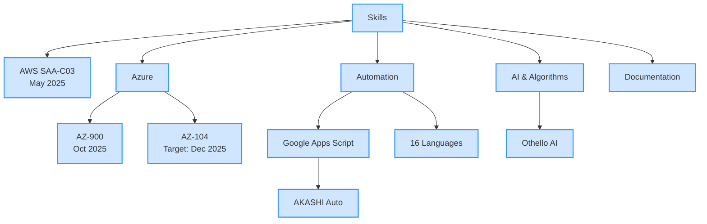
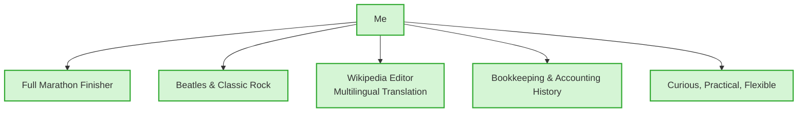

## 🌟 takeshiyoshida76's Portfolio 🏃
**Cloud × Automation × AI** – Building practical, scalable solutions for business efficiency

[](https://github.com/takeshiyoshida76)
[](https://www.linkedin.com/in/your-linkedin-id) <!-- Update with your ID -->

> **"Automate the tedious. Free human time."**  
> Cloud engineer & automation developer blending AWS, Azure, and Google Apps Script with AI-driven logic.

---

### About Me

| Category | Details |
|--------|---------|
| **Certifications** | - **AWS Certified Solutions Architect – Associate (SAA-C03)** – *May 2025* ✅<br>- **Microsoft Azure Fundamentals (AZ-900)** – *Oct 2025* ✅<br>- **Microsoft Azure Administrator (AZ-104)** – *Targeting Dec 2025*<br>- IPA Applied Information Technology Engineer (AP) – *Nov 2012* ✅<br>- IPA Fundamental Information Technology Engineer (FE) – *May 2001* ✅ |
| **Focus Areas** | Business automation, cloud integration, multilingual programming, AI algorithms |
| **Mission** | Deliver maintainable, documented, and scalable automation tools that solve real-world problems |

---

### Highlight Projects

| Project | Tech | Key Features |
|--------|------|--------------|
| **AKASHI Time Tracking Automation** | Google Apps Script (JavaScript) | Secure login, WAF bypass, error handling, timesheet extraction. Full design docs included. |
| **Multilingual Program Collection** | 16 Languages (Python, Java, Go, COBOL, etc.) | Demonstrates syntax diversity and cross-language design patterns. Great for learning. |
| **AI-Powered Othello (Reversi)** | Algorithmic AI + Evaluation Logic | Strategic decision-making engine. Explores game theory and heuristic search. |
| **Daily Report AI Summary & Email (Lambda)** | Python + AWS Lambda + Gemini API + Gmail API | Auto-generates concise summaries and action items from raw reports using Gemini AI. Sends formatted email via Gmail API. Secure token management with AWS SSM. Skips holidays. |
| **Upcoming** | Azure Functions + React + GitHub Pages | Cloud-native demo web app for automation workflows (in development) |

---

### Repository Structure

```
├── src/     → Source code in multiple languages
├── docs/    → Design documents, architecture diagrams, specifications
└── README.md → You're here!
```

---

### Skills Mind Map


---

### Personality & Interests


---

### Contact & Collaboration
- Like what you see? **Star this repo** or **open an issue** to connect!
- Questions about design docs, code, or collaboration? I'm all ears.
- Propose ideas → [Issues](https://github.com/takeshiyoshida76/portfolio/issues)

---

## License
[MIT License](LICENSE) © 2025 takeshiyoshida76
