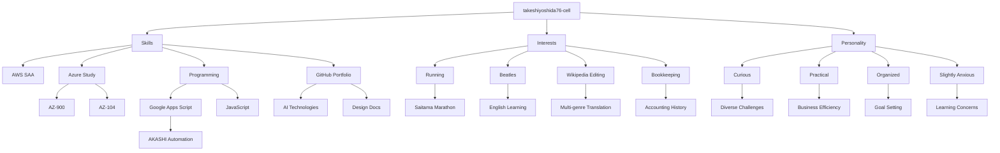

## takeshiyoshida76's Portfolio
Welcome to my GitHub portfolio! I'm a cloud enthusiast and developer, working on automation and AI-driven projects. Below is an overview of my skills, interests, and personality, visualized with a mind map.

### About Me
- **Background:** AWS Certified Solutions Architect Associate (SAA-C03) holder, currently studying for Azure AZ-900 and AZ-104 to expand my cloud expertise.
- **Projects:** Built multiple Google Apps Script tools for AKASHI time tracking automation, including login and error handling.
- **Goal:** Create practical solutions for business efficiency while exploring AI and cloud technologies.

### My Skills and Interests

### Projects
- **AKASHI Automation Scripts:**
  - Built with Google Apps Script (JavaScript).
  - Features: Automated login, timesheet extraction, and WAF bypass for AKASHI time tracking.
  - Includes design documents for clear process outlines.
- **Future Plans:**
  - Integrate Azure Functions with automation scripts.
  - Build a demo web app using React and GitHub Pages.

### Discription
This repository is a personal portfolio created using various programming languages ​​and AI technologies. It also includes design documents.
- The `src/` folder contains code written in Python, VBScript, etc.
- The `docs/` folder contains documentation related to the project's design.

### Contact
- Check my repositories for more projects!
- Reach out via GitHub Issues for collaboration.

## License
MIT License ([LICENSE](LICENSE)).
