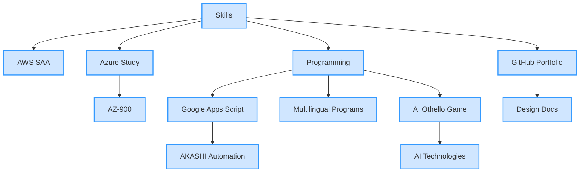
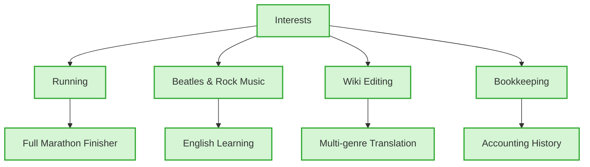
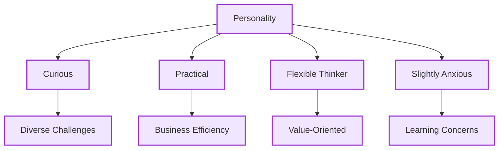

## 🌟 takeshiyoshida76's Portfolio 🏃
Welcome to my GitHub portfolio! I'm a cloud enthusiast and automation developer passionate about building efficient, AI-powered solutions. This space showcases my skills, interests, and personality—visualized through a dynamic mind map.

### About Me
- **Certifications:**
  - AWS Certified Solutions Architect Associate (SAA-C03)
  - IPA Fundamental Information Technology Engineer (FE)
  - IPA Applied Information Technology Engineer (AP)
  - Currently studying for Microsoft Azure AZ-900 and AZ-104
- **Development Focus:**
  - Creator of multiple Google Apps Script tools for AKASHI time tracking automation, featuring robust login flows and error-handling mechanisms
  - Developed a multilingual program collection using 16 different programming languages
  - Built an AI-powered Othello (Reversi) game with strategic evaluation logic
- **Goal:**
  Deliver practical, scalable solutions for business automation while exploring the intersection of cloud and AI technologies.

### Projects
- **AKASHI Automation Scripts:**
  - Developed using Google Apps Script (JavaScript)
  - Key Features: Automated login, timesheet extraction, and WAF bypass for AKASHI time tracking
  - Includes detailed design documentation for transparency and maintainability
- **Multilingual Program Collection:**
  - A set of simple programs written in 16 different languages, showcasing syntax diversity and cross-language understanding
- **AI Othello Game:**
  - Built with strategic evaluation logic and AI decision-making
  - Demonstrates game theory and algorithmic design
- **Upcoming Initiatives:**
  - Integrate Azure Functions to enhance automation workflows
  - Build a demo web app using React and GitHub Pages to showcase cloud-native development

### Repository Structure
This portfolio is a collection of projects built with various programming languages and AI technologies, accompanied by design documentation.
- `src/` — Source code (Python, VBScript, etc.)
- `docs/` — Design documents and technical specifications

### Skills & Interests
- **Skills**

- **Interests**

- **Personality**

### Contact & Collaboration
- Explore more projects in my repositories.
- For collaboration or inquiries, feel free to open an issue.

## License
MIT License ([LICENSE](LICENSE)).
