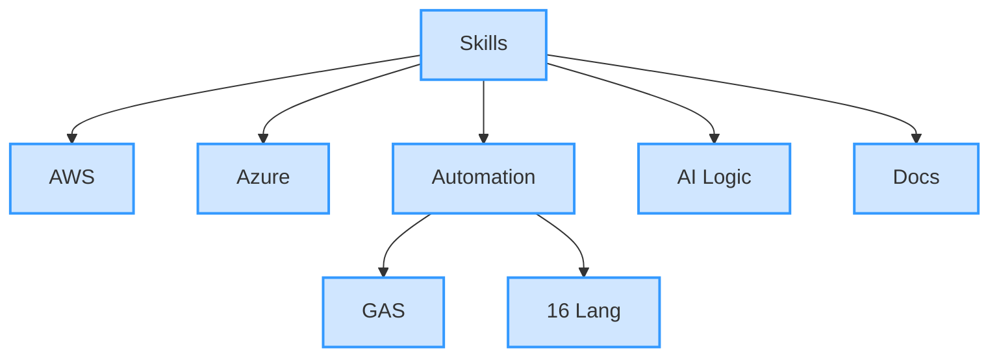
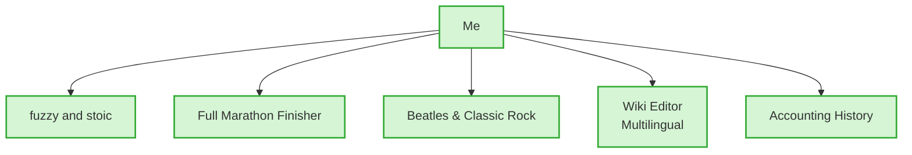

## 🌟 takeshiyoshida76's Portfolio 🏃
**Cloud × Automation × AI** – *fuzzy and stoic* solutions for real-world chaos

[](https://github.com/takeshiyoshida76-cell)
[](https://x.com/RunningTsum)

> **"fuzzy and stoic"**  
> Life’s messy. Embrace the blur (*fuzzy*). Keep moving (*stoic*).  
> I automate chaos so you don’t have to.

---

### About Me

| Category | Details |
|--------|---------|
| **Certs** | AWS SAA-C03 · Azure AZ-900 · AZ-104 (Dec target) · IPA AP & FE |
| **Focus** | Automation, cloud, polyglot code, AI that *just works* |
| **Mission** | Ship solid tools that survive real-world fuzziness |

---

### Highlight Projects

| Project | Tech | Vibe |
|--------|------|------|
| **AKASHI Auto** | Google Apps Script | Logs in, grabs timesheets, survives WAF — docs included |
| **16 Languages** | Python → COBOL | Syntax playground. Learn by comparison |
| **AI Othello** | Pure logic | Thinks 5 moves ahead. No fluff |
| **Daily Report AI** | Lambda + Gemini + Gmail | Summarizes, emails, skips holidays, retries at 9 AM — **fuzzy-proof** |
| **Next Up** | Azure Functions + React | Workflow demo. Coming soon-ish |

---

### Repo Layout

```
├── src/     → Code in many tongues
├── docs/    → Diagrams, specs, "why"
└── README.md → You're here!
```

---

### Skills Mind Map


---

### Personality & Interests


---

### Contact & Collaboration
- Like it? **Star** or **open an issue**
- Questions on code, docs, or ideas? Always welcome
- Propose → [Issues](https://github.com/takeshiyoshida76/portfolio/issues)

---

## License
[MIT License](LICENSE) © 2025 takeshiyoshida76
