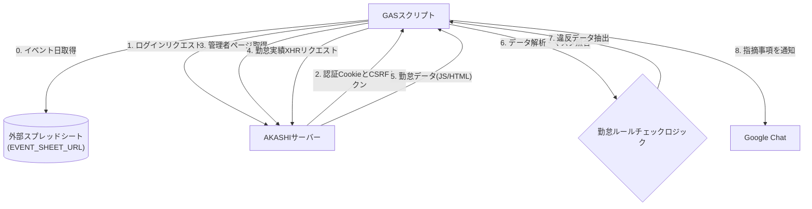

## 勤怠実績チェック自動化システム 基本設計書

---

## 1. 概要

### 1.1. システム名称

Akashi勤怠実績チェック自動化システム (Google Apps Script)

### 1.2. 目的

勤怠管理システム**AKASHI**から社員の月次勤務実績データを自動で取得し、あらかじめ定義された勤怠ルール（打刻漏れ、理由記載漏れ、休憩時間不足、超過勤務時の理由・指示者記載漏れなど）に違反がないかをチェックする。違反事項を**Google Chat**へ通知することで、管理者のチェック業務の負担軽減と、勤怠実績の早期是正を促進する。

### 1.3. 対象範囲

| 項目 | 内容 |
| :--- | :--- |
| **対象システム** | AKASHI（管理者ページ） |
| **実行環境** | Google Apps Script (GAS) |
| **通知先** | Google Chat (Webhook) |
| **対象データ** | 対象社員の指定された年月の勤務実績データ（当日以降の未来日はチェック対象外） |
| **外部マスタ** | Googleスプレッドシート（特定日イベント管理）|
| **実行タイミング** | 毎週実行を推奨（22日以降は翌月の勤怠実績をチェック） |
| **対応労働制** | フレックスタイム制、通常労働制（ノーマル） |

---

## 2. システム構成

### 2.1. 構成図（Mermaid）

システムと外部サービスとの連携を以下の図に示します。

---

## 3. 機能設計
### 3.1. 主要機能一覧

| No.| 機能名| 概要|
| :--- | :--- | :--- |
| 3.1.1| 認証情報取得機能| スクリプトプロパティからAKASHIログイン情報を取得する。|
| 3.1.2| AKASHIログイン機能| 認証情報とCSRFトークンを用いてAKASHIにログインし、セッションCookieを維持する。|
| 3.1.3| 対象年月決定機能| 実行日（JST）が22日以降の場合、チェック対象を翌月とする。|
| 3.1.4| 勤怠実績取得機能| 対象従業員ID、対象年月に基づき、管理者ページから月次の勤怠実績データをXHRで取得する。|
| 3.1.5| データ解析機能| 取得したHTML/JSデータから、日付、打刻/実績時間、休憩、残業、ステータス、理由欄のテキストなどを抽出する。|
| 3.1.6| 勤怠ルールチェック機能| 抽出した実績データに基づき、定義されたルールに違反がないかチェックする。|
| 3.1.7| 通知機能| 指摘事項がある場合は社員ごとに集約し通知。指摘事項が0件の場合も「チェック完了・0件」を通知する。|
| 3.1.8| 特定日マスタ取得機能| 外部スプレッドシートから特定日の日付とイベント名（複数キーワード可）を取得する。|

### 3.2. 勤怠ルールチェック詳細

スクリプトで実装されている主な勤怠ルールチェック項目と内容を以下に示します。

| No. | チェック内容 | 判定条件 | 通知メッセージ例 |
| :--- | :--- | :--- | :--- |
| 1 | **打刻忘れ（一律警告）** | 打刻がないが実績時間がある（理由の有無は問わない） | 打刻忘れがあります（理由が記載されていても要確認） |
| 2 | **打刻と実績の乖離（一律警告）** | 出勤打刻と実績時間の差が **30**分以上（理由の有無は問わない） | 出勤打刻と実績が30分以上乖離しています（理由が記載されていても要確認） |
| 3 | **遅刻の理由漏れ** | 勤務状況に「遅刻」が含まれる **かつ** 理由欄にキーワード（理由、ため、為、に基づく、会議、による）がない。 | 遅刻しているが理由欄に遅刻理由が記載されていない可能性あり |
| 4 | **早退の理由漏れ** | 勤務状況に「早退」が含まれる **かつ** 理由欄にキーワードがない。 | 早退しているが理由欄に早退理由が記載されていない可能性あり |
| 5 | **休憩時間不足** | 実働時間 **> 6**時間 **かつ** 休憩時間 **< 45**分、または 実働時間 **> 8**時間 **かつ** 休憩時間 **< 60**分。 | 実働6時間超で休憩45分未満 / 実働8時間超で休憩1時間未満 |
| 6 | **残業/指示者記載漏れ** | 残業時間 **> 0**分 **かつ** 理由欄にキーワード **または**「指示」がない。（フレックスで60分以内は除外） | 残業があるが理由または指示者が記載されていない |
| 7 | **計画外の早退理由漏れ** | 退勤打刻 **<** 退勤予定時間 **かつ** 理由欄にキーワードがない。 | 退勤予定前に打刻されているが理由が記載されていない可能性あり |
| 8 | **在宅勤務と理由欄の矛盾（在宅未反映）** | 理由欄に「在宅勤務」あり かつ 勤務状況に「在宅勤務」なし かつ 理由欄に出社関連語（出社/出勤/移動）がない。 | 理由欄に在宅勤務とあるが勤務状況に未記載、出社していなければ勤務状況を更新すること |
| 9 | **在宅勤務と理由欄の矛盾（出社記載）** | 勤務状況に「在宅勤務」あり かつ 理由欄に「出社」「へ出勤」「に出勤」「移動」あり | 勤務状況が在宅勤務とあるが理由欄に出社がある |
| 10 | **半日休暇と残業の矛盾** | 勤務状況に「午前半年休」または「午後半年休」あり かつ 残業時間 > 0分 | 半日休暇にもかかわらず残業が入力されている |
| 11 | **半日休暇と休憩時間の矛盾** | 勤務状況に「午前半年休」または「午後半年休」あり かつ 休憩時間 ≥ 45分 | 半日休暇にもかかわらず勤務時間外の不要な休憩時間が入力されている可能性あり |
| 12 | **電車遅延の矛盾** | 勤務状況に「電車遅延」がある **かつ** 実績出勤時間 **=** 予定出勤時間、または 勤務状況に「遅刻」が含まれる。 | 電車遅延理由があるが実績出勤時間が予定と同一となっている |
| 13 | **振替出勤/休日の理由漏れ** | 勤務状況に「振替出勤」「休日出勤」が含まれる **かつ** 理由欄にキーワード **または**「指示」がない。 | 休日出勤にもかかわらず、休出理由または指示者が記載されていない |
| 14 | **振替休日の理由漏れ** | 勤務状況に「振替休日」あり かつ 理由欄に「の振休」「の振替休日」を含まない。 | 振替休日にもかかわらず、振替元の日付が記載されていない |
| 15 | **代休の理由漏れ** | 勤務状況に「代休」あり かつ 理由欄に「代休」を含まない。 | 代休にもかかわらず、代休元の日付が記載されていない |
| 16 | **有休と在宅勤務の同時記載** | 勤務状況に「年休」（半年休以外）あり かつ 「在宅勤務」あり | 有休と在宅勤務が同時に記載されている |
| 17 | **遅刻時間と休憩時間の混同疑い** | 遅刻180分以上かつ休憩>30分、または早退240分以上かつ休憩>30分（参考情報として警告） | 休憩時間が遅刻/早退時間として換算されている可能性あり |
| 18 | **特定日イベントの理由記載漏れ** | **特定日マスタに該当日がある** かつ **勤務状況に「休」を含まない** 状態で、理由欄にマスタ指定のキーワードが含まれない。| 「部会議」の開催日ですが、不参加でしょうか"

---

## 4. データ設計
### 4.1. 勤怠データ構造

GASスクリプト内で解析・利用される日ごとの勤怠データ構造 (Object) は以下の通りです。

| 項目名| 型| 説明|
| :--- | :--- | :--- |
| dateStr |string |日付 (yyyymmdd)|
| clockIn, clockOut| string| 打刻時刻 (hh:mm)|
| actualIn, actualOut| string| 実績時刻 (hh:mm)|
| plannedIn, plannedOut| string| 予定時刻 (hh:mm)|
| status| string| 勤務状況（例: 遅刻/在宅勤務/年休など）|
| totalTime| string| 実労働時間 (h:mm)|
| breakTime| string| 休憩時間 (h:mm)|
| overtime| string| 残業時間 (h:mm)|
| nightTime| string| 深夜時間 (h:mm)|
| lateTime| string| 遅刻/早退時間 (h:mm)|
| reason| string| 理由欄に記載されたテキスト|

### 4.2. 設定データ (スクリプトプロパティ)

本システム実行に必須の外部設定情報です。

| プロパティ名| 用途| 必須/任意|
| :--- | :--- | :--- |
| COMPANY_ID| AKASHIログイン用の企業ID| 必須|
| LOGIN_ID| AKASHIログイン用の管理者ログインID| 必須|
| PASSWORD| AKASHIログイン用のパスワード| 必須|
| CHAT_WEBHOOK_URL| Google Chatへの通知用Webhook URL| 必須|
| EVENT_SHEET_URL| 特定日イベントを管理するスプレッドシートのURL| 必須|

### 4.3. 外部マスタ（スプレッドシート）構成

| 列| 項目| 説明|
| :--- | :--- | :--- |
| A列| 日付| 判定対象日（日付形式：yyyy/mm/dd）|
| B列| イベント名| 理由欄に含まれるべきキーワード（カンマ区切りで複数指定可）|

---

## 5. 実行環境・設定

### 5.1. 実行環境

* **プラットフォーム**: Google Apps Script (GAS)
* **言語**: JavaScript (ES5/6 相当)
* **外部サービス**: UrlFetchApp, PropertiesService, Utilities

### 5.2. 初期設定手順

1. **GASのデプロイ**: 提供されたスクリプトをGASエディタにコピー＆ペーストします。
2. **スプレッドシートの作成:** A列に日付、B列にイベント名を入れたシートを用意します。
3. **定数設定**: スクリプト内の`TARGET_EMPLOYEE_IDS`に対象従業員IDの配列を設定します。
4. **スクリプトプロパティ設定**: GASエディタのプロジェクト設定またはスクリプトプロパティ画面から、以下の4つのプロパティを設定します。
    * `COMPANY_ID`
    * `LOGIN_ID`
    * `PASSWORD`
    * `CHAT_WEBHOOK_URL`
    * `EVENT_SHEET_URL` 作成したシートのURLを設定します。
5. **トリガー設定**: 毎日決まった時間（例: 業務時間終了後）に`main`関数が実行されるよう、時間ベースのトリガーを設定します。

---

## 6. 運用・保守

### 6.1. ログ管理

* GASの実行ログ (`Logger.log`) を使用し、ログイン成否、エラー発生時の詳細情報、処理の進捗を記録します。
* エラー発生時やログイン失敗時は、Google Chatにも通知されます。

### 6.2. メンテナンス

* **特定日の追加:** 新年会、部会議、健康診断など、特定の理由記載を徹底させたい日は、スプレッドシートに行を追加するだけで対応可能です。
* **表記ゆれ対応:** 社員の入力傾向に合わせ、スプレッドシート側のキーワードを「カンマ区切り」で拡充してください。
* AKASHIのHTML構造やログインフロー、APIエンドポイントが変更された場合、スクリプトの改修が必要となります。
* 勤怠ルールに変更があった場合は、`checkMonthlyAttendance`関数内のチェックロジックを更新します。

### 6.3. セキュリティ

* AKASHIの認証情報は、スクリプト本体ではなく**スクリプトプロパティ**に安全に保存されます。
* AKASHIへのリクエストは、遅延 (`addRandomDelay`) を挿入し、サーバーへの過負荷やスクレイピングと見なされるリスクを軽減しています。
* 機密情報（パスワードなど）はログに出力されません。

---

## 7. お問い合わせ先

本スクリプトに関するお問い合わせ、機能追加・変更のご要望は、以下までご連絡ください。

* **担当:** 業務推進部.葭田
* **連絡先チャットID:** @moc_01440
* **連絡先メールアドレス:** t_yoshida@mocweb.co.jp

---
