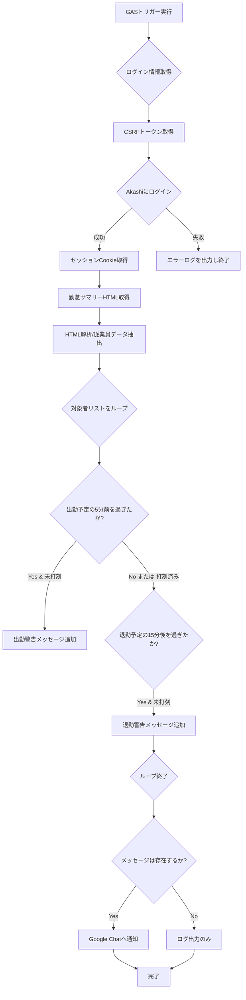

# 勤怠打刻漏れチェック＆通知スクリプト 基本設計書

## 1. 概要

本スクリプトは、Akashi勤怠管理システムに自動ログインし、特定の日次勤怠サマリーページから対象者の出退勤データを取得します。

取得したデータに基づき、**所定の時刻（出勤予定時刻の5分前、退勤予定時刻の15分後）を過ぎても打刻がない**場合に、打刻漏れの可能性を検知し、Google Chatへ通知を行います。

## 2. 目的

特定の対象者に対し、出勤・退勤の打刻忘れをリアルタイムに近い形で通知することで、勤怠データの正確性を高め、管理者による修正工数を削減することを目的とします。

## 3. 機能一覧

| No. | 機能名 | 概要 | 関連関数 |
| :--- | :--- | :--- | :--- |
| 3.1 | 認証情報取得 | スクリプトプロパティからログインID、パスワード、Webhook URLなどの設定値を取得する。 | `getCredentials()` |
| 3.2 | ログイン処理 | ログインページからCSRFトークンを取得後、認証情報を用いてログインし、セッションCookieを取得する。 | `loginToAkashi()`, `getCsrfToken()` |
| 3.3 | HTML取得 | ログインセッション（Cookie）を使用して、日次勤怠サマリーページのHTMLコンテンツを取得する。 | `fetchAttendanceHTML()` |
| 3.4 | データ解析 | 取得したHTMLを正規表現で解析し、対象者の氏名、予定時刻、実績時刻を抽出する。 | `parseAttendanceHTML()` |
| 3.5 | 打刻チェック | 現在時刻と予定時刻を比較し、出勤（5分前）および退勤（15分後）の通知条件を満たしているかを判定する。 | `checkAttendance()`, `parseTime()` |
| 3.6 | 通知送信 | 判定結果に基づき、指定されたGoogle Chat Webhook URLへ警告メッセージを送信する。 | `sendToGoogleChat()` |

## 4. 実行タイミングと処理基準時刻

本スクリプトは、Google Apps Scriptのトリガー機能を用いて、**定期的に実行されること**を想定しています。

| 項目 | 詳細 |
| :--- | :--- |
| **時刻基準** | 日本時間（JST） |
| **出勤通知基準** | 予定出勤時刻の **5分前** 以降に実績打刻がない場合 |
| **退勤通知基準** | 予定退勤時刻の **15分後** 以降に実績打刻がない場合 |
| **対象者設定** | スクリプト内の定数 `TARGET_NAMES` に設定された氏名（姓のみで判定） |

## 5. 入出力およびデータ構造

### 5.1 スクリプトプロパティ（入力設定）

| 設定キー | 必須/任意 | 説明 |
| :--- | :--- | :--- |
| `COMPANY_ID` | 必須 | 勤怠システムへのログインに必要な企業ID |
| `LOGIN_ID` | 必須 | 勤怠システムへのログインID |
| `PASSWORD` | 必須 | 勤怠システムへのログインパスワード |
| `WEBHOOK_URL` | 必須 | Google Chatの通知先Webhook URL |

### 5.2 定数（入力設定）

| 定数名 | 説明 |
| :--- | :--- |
| `TARGET_NAMES` | チェック対象とする従業員のリスト（氏名）。コードでは氏名の姓の部分のみでマッチングを行う。 |
| `LOGIN_URL` | 勤怠システムのログインページのURL |
| `ATTENDANCE_URL` | 日次勤怠サマリーページのURL |

### 5.3 勤怠データ構造（内部処理）

`parseAttendanceHTML`関数によって生成され、`checkAttendance`関数で利用される従業員データ構造です。

| キー | 型 | 説明 |
| :--- | :--- | :--- |
| `name` | `string` | 従業員名（姓と名） |
| `scheduledStart` | `string` | 予定出勤時刻（`HH:mm`形式 または `--:--`） |
| `scheduledEnd` | `string` | 予定退勤時刻（`HH:mm`形式 または `--:--`） |
| `actualStart` | `string` | 実績出勤時刻（`HH:mm`形式 または `--:--`） |
| `actualEnd` | `string` | 実績退勤時刻（`HH:mm`形式 または `--:--`） |

## 6. 処理フロー

## 7. 留意事項

1.  **HTML構造への依存性:**
    * データ解析（`parseAttendanceHTML`）は、勤怠システムの日次サマリーページのHTML構造（特定の`class`名や要素の並び）に強く依存しています。
    * 勤怠システム側でHTML構造が変更された場合、**正規表現によるデータ抽出が機能しなくなり、スクリプトが動作停止する**可能性があります。
2.  **認証情報の管理:**
    * ログインIDとパスワードは`PropertiesService`に安全に格納されていますが、スクリプトの実行権限を持つユーザーは閲覧可能です。取り扱いに十分注意してください。
3.  **時刻同期:**
    * 現在時刻の取得にはGASの`Utilities.formatDate`を使用し、JSTであることを保証していますが、実行タイミングとサーバー時刻のズレにより、数秒〜数十秒程度の誤差が生じる可能性があります。
4.  **対象者判定:**
    * `TARGET_NAMES.includes(employee.name.split(' ')[0])` のように、従業員名の**姓のみ**で判定を行っています。同姓の従業員がいる場合は注意が必要です。
