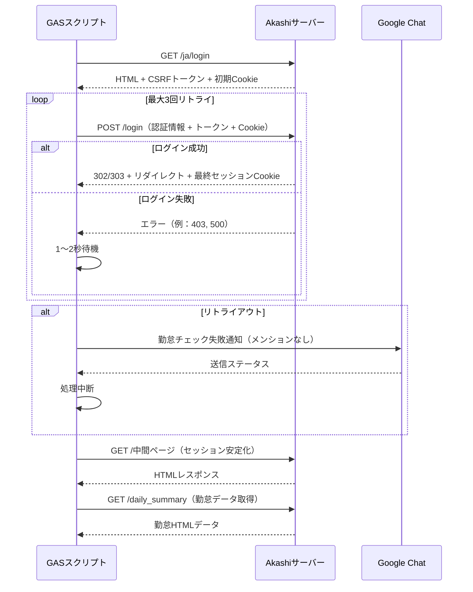
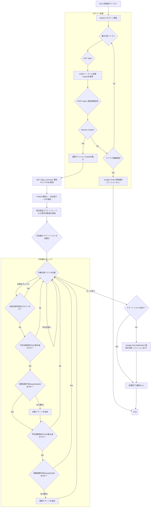
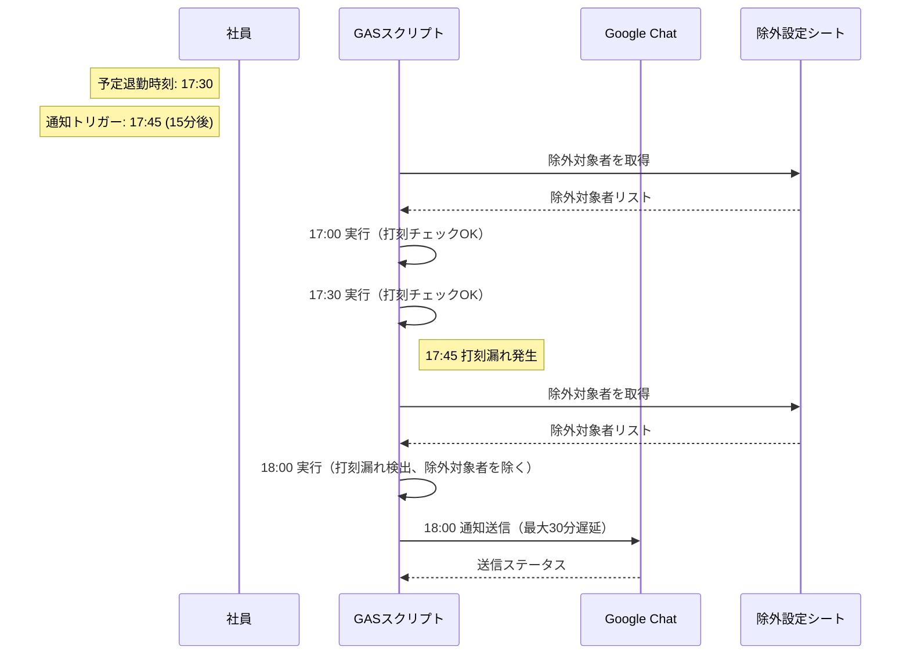

# Akashi勤怠チェック自動化スクリプト 基本設計書

## 1. 概要

本スクリプトは、Google Apps Script (GAS) を実行環境とし、Webスクレイピング技術を用いてクラウド勤怠管理システム「Akashi」から社員の当日の勤怠情報を取得します。取得したデータに基づき、出勤・退勤の打刻漏れをチェックし、Google ChatのWebhookを通じて管理者へリアルタイムに通知することを目的とします。特定の社員を特定の日付で出勤・退勤アラートから除外する設定をGoogleスプレッドシートで管理可能です。

### 実行環境

* **実行環境:** Google Apps Script (GAS)
* **通信:** `UrlFetchApp` を利用した外部通信
* **通知先:** Google Chat Webhook
* **除外設定:** Googleスプレッドシート（`除外設定`シート）

---

## 2. 認証周りの仕様 (Akashiログイン)

Akashiのログインは、セッション管理とCSRFトークンを伴う一連のブラウザ操作をシミュレーションすることで行います。

### 2.1 認証情報

認証に必要な情報は、GASの**スクリプトプロパティ**に機密情報として設定され、コード内に直接記述することはありません。

| 項目名 | 用途 | 備考 |
| :--- | :--- | :--- |
| `COMPANY_ID` | 企業ID | ログイン時に使用 |
| `LOGIN_ID` | ログインID | ログイン時に使用 |
| `PASSWORD` | パスワード | ログイン時に使用 |
| `WEBHOOK_URL` | Google Chat Webhook URL | 通知送信先 |
| `EXCLUSION_SHEET_ID` | 除外設定のスプレッドシートのID | 特定の社員を特定の日付でアラート対象外にする設定に使用 |

### 2.2 ログインシーケンス

1. **[GET] ログインページアクセス:** `LOGIN_URL` (`/ja/login`) にアクセスし、レスポンスHTMLから `authenticity_token` **(CSRFトークン)** を抽出し、**初期セッションCookie**を保持します。
2. **[POST] ログインフォーム送信:** 取得したCSRFトークンと認証情報をペイロードとして `POST` します。HTTPヘッダーには、保持しているセッションCookieを設定します。
3. **リトライ処理:** ログイン失敗時（例：ネットワークエラー、セッション確立失敗）、最大3回、1～2秒間隔でリトライします。
4. **セッション確立:** リダイレクトヘッダーから**最終セッションCookie**を取得し、以降のデータ取得リクエストで使用します。
5. **リトライアウト時の通知:** リトライがすべて失敗した場合、Google Chatに「勤怠チェック失敗」メッセージを送信（メンションなし）。
6. **ページ遷移:** セッション安定のため、勤怠サマリページ (`/daily_summary`) の前に中間ページ（`/ja/manager`, `/current_attendance_status`）を `GET` でアクセスします。



---

## 3. 勤怠データ抽出・チェックの仕様

確立されたセッションCookieを使用して「日次勤怠サマリ」ページにアクセスし、打刻漏れの判定を行います。特定の社員を特定の日付で出勤・退勤アラートから除外する設定は、Googleスプレッドシートで管理されます。

### 3.1 データ抽出 (Webスクレイピング)

* **対象ページ:** 勤怠サマリURL (`https://atnd.ak4.jp/ja/manager/daily_summary`)。**当日**のデータを取得します。
* **抽出方法:** HTML内の勤怠情報を含む `<tr>` タグを正規表現で抽出し、以下の情報をパースします。

| データ項目 | 抽出元 | 備考 |
| :--- | :--- | :--- |
| **氏名** (`name`) | `<td>` (Index 1) | **名字のみ**を抽出し、通知対象の判定に使用 |
| **実績出勤打刻** (`stampStart`) | `<td>` (Index 2) | `HH:MM` または 未打刻時は `--:--` |
| **実績退勤打刻** (`stampEnd`) | `<td>` (Index 2) | `HH:MM` または 未打刻時は `--:--` |
| **勤務状況** (`statusText`) | `<td>` (Index 5) | 年休、半休（午前/午後）、振替休日、在宅勤務などの情報を含みます。 |
| **予定出勤** (`scheduledStart`) | `<td>` (Index 4) **または** 勤務状況 | Akashiのデフォルト予定時刻。**ただし、勤務状況に「年休」「振替休日」「代休」「記念日休暇」「午前半年休」がある場合は、打刻漏れチェックの基準時間を上書きします。** |
| **予定退勤** (`scheduledEnd`) | `<td>` (Index 4) **または** 理由欄 **または** 勤務状況 | Akashiのデフォルト予定時刻。ただし、 1.**理由欄** に `残業終了=HH:MM` のキーワードがある場合は、その `HH:MM` で上書きします。2.**勤務状況に「年休」「振替休日」「代休」「記念日休暇」「午後半年休」がある場合は、打刻漏れチェックの基準時間を上書きします。** 上記1, 2のいずれも該当しない場合は Index 4 の値をそのまま使用します。 |
| **理由欄** (`reason`) | `<td>` (Index 11) | フリーコメント欄。残業終了時刻を含みます。 |

```
補足: 予定出勤・予定退勤欄は、(Index 4) の項目が Akashiの以下の仕様があるため、本スクリプトで対応しています。
・年休、振替休日、代休、記念日休暇: 予定出退勤は定時が設定される。
・午前半年休: 予定出勤は実際の出勤予定時刻ではなく通常勤務時の出勤予定時刻が設定される。
・午後半年休: 予定退勤は実際の出勤退勤時刻ではなく通常勤務時の退勤予定時刻が設定される。
・残業: 予定退勤には残業予定時刻は反映されず、通常勤務時の退勤予定時刻が設定される。
```

### 3.2 打刻漏れチェックロジック

チェックは**現在のJST時刻**を基準に行われます。スプレッドシート（`除外設定`シート）に登録された社員は、指定された日付において出勤・退勤アラートの両方が抑制されます。

| チェック項目 | 条件 | 通知トリガー時刻 (現在時刻が基準) | 通知メッセージ |
| :--- | :--- | :--- | :--- |
| **出勤打刻漏れ** | (1) **実績出勤打刻**が `--:--` <br/> (2) **最終的な予定出勤**が `--:--` ではない <br/> (3) **社員が除外設定されていない** | 最終的な予定開始時刻の **5分前 以降** | 「**出勤**打刻が行われていません」 |
| **退勤打刻漏れ** | (1) **実績退勤打刻**が `--:--` <br/> (2) **最終的な予定退勤**が `--:--` ではない <br/> (3) **社員が除外設定されていない** | 最終的な予定終了時刻の **15分後 以降** | 「**退勤**打刻が行われていません」 |

#### 3.2.1 休暇（年休・半休・記念日休暇等）時の打刻チェック基準の上書き

勤務状況 (`<td>` Index 5) に「年休」「振替休日」「代休」「記念日休暇」または「半休」の記載がある場合、打刻漏れチェックの基準となる予定時刻は以下のように上書きされます。

* **「年休」「振替休日」「代休」「記念日休暇」の場合:**
  * **予定出勤時刻:** `--:--` (終日勤務なし)
  * **予定退勤時刻:** `--:--` (終日勤務なし)
  * **チェック:** この場合、終日勤務予定がないと判断され、打刻漏れチェックは行われません。

* **「午前半年休」の場合:**
  * **予定出勤時刻:** `13:00` (午後から出勤)
  * **予定退勤時刻:** 元の予定退勤時刻、または理由欄の残業終了時刻を適用
  * **チェック:** 午後からの出勤予定と判断され、13:00以降の実績出勤打刻の有無をチェックします。

* **「午後半年休」の場合:**
  * **予定出勤時刻:** 元の予定出勤時刻を適用
  * **予定退勤時刻:** ``12:00`` (午前中で退勤)
  * **チェック:** 午前中までの勤務予定と判断され、12:00以降の実績退勤打刻の有無をチェックします。

#### 3.2.2 除外設定（スプレッドシート管理）

特定の社員を特定の日付で出勤・退勤アラートから除外する設定は、Googleスプレッドシート（`除外設定`シート）で管理されます。管理者はこのシートを編集することで、ソースコードを修正せずに除外設定を追加・変更できます。

* **スプレッドシート構造:**
  * **シート名:** `除外設定`
  * **列構成:**
    * **A列:** 日付（YYYYMMDD形式、例: `20251010`）
    * **B列:** 対象者（名字、例: `葭田`）
  * **例:**

* **処理:**
  * スクリプト実行時に、現在の日付（YYYYMMDD形式）に対応する除外対象者リストをスプレッドシートから取得。
  * 除外対象者に指定された社員は、その日付の出勤・退勤アラートが抑制される。
  * スプレッドシートID（`EXCLUSION_SHEET_ID`）はスクリプトプロパティに設定。

* **エラー処理:**
  * スプレッドシートIDが未設定、またはシートが存在しない場合、除外対象者を空（全員チェック対象）として処理を継続。
  * 不正なデータ（例: 日付形式が異なる、名字が空）の行は無視される。

### 3.3 通知対象のフィルタリング

スクリプト内の `TARGET_NAMES` 定数 (名字の配列) を用いて制御します。

* **`TARGET_NAMES` が空:** 全社員をチェック対象とします。
* **`TARGET_NAMES` に値がある:** リストに含まれる名字の社員のみをチェック対象とします。
* **除外設定の優先:** `TARGET_NAMES` に含まれていても、スプレッドシートの除外設定に登録された社員はアラート対象外となります。

### 3.4 通知処理

打刻漏れが1件以上検出された場合、Google Chat Webhook経由で通知を送信します。通知内容は打刻アラートのヘッダーと、打刻漏れが発生している社員ごとのメッセージを結合したものです。

---

## 4. 処理フロー

システム全体の処理フローをMermaid形式で示します。



---

## 5. 非機能要件

| 項目 | 内容 |
| :--- | :--- |
| **信頼性** | GASの組み込みリトライ機能に加え、ログイン失敗時に最大3回（1～2秒間隔）のリトライを実装。一時的なネットワークエラー（例：タイムアウト、サーバー過負荷）に対応。リトライアウト時はGoogle Chatにエラー通知を送信。スプレッドシート読み込みエラー時は除外対象者を空として処理を継続。連続した実行失敗時は、通知ログを確認し、手動でスクリプトを停止・再開することを想定します。 |
| **性能** | Akashiへのアクセスは原則として1日数十回（またはトリガー設定頻度）とし、システムへの負荷を最小限に抑えます。ランダム遅延（例：2～5秒）を挿入し、サーバー負荷を分散。スプレッドシート読み込みは実行ごとに1回行い、データ量が大きくてもパフォーマンスへの影響を最小限に抑えます。GASの実行時間は最長5分以内での完了を目指します。 |
| **セキュリティ** | Akashiの認証情報、Google ChatのWebhook URL、スプレッドシートIDは、すべてGASの**スクリプトプロパティ**に設定し、コード内に直接記述することはしません。スプレッドシートの編集権限は許可された管理者に限定し、スクリプト実行アカウントにアクセス権限を設定。GASの実行権限は、スクリプトの所有者に限定されます。 |
| **保守性** | 主要な設定値（ID、パスワード、URL、通知対象者リスト、スプレッドシートID）は、コード上部の定数またはスクリプトプロパティに集約。除外設定はスプレッドシートで管理し、コード修正なしで運用可能。本スクリプトに関するお問い合わせや仕様変更要望は、**9. お問い合わせ先** までご連絡ください。 |

---

## 6. エラーハンドリング

| フェーズ | 発生しうるエラー | 対応策 |
| :--- | :--- | :--- |
| **ログイン** | 認証情報間違い、Akashi側のURL変更、メンテナンス、ネットワークエラー（例：タイムアウト）など | `try-catch` で捕捉し、最大3回リトライ（1～2秒間隔）。リトライアウト時はGoogle Chatに「勤怠チェック失敗」通知を送信（メンションなし）。エラーメッセージをGASのコンソールログに出力して処理を中断・終了します。 |
| **データ取得** | Akashi側のHTML構造変更、ネットワークエラーなど、セッション切断など | `try-catch` で捕捉し、セッション切断時はログインを再試行（最大3回）。エラーメッセージをコンソールログに出力し、処理を中断・終了します。 |
| **スプレッドシート読み込み** | スプレッドシートID未設定、シート不存在、アクセス権限エラーなど | `try-catch` で捕捉し、エラーメッセージをコンソールログに出力。除外対象者を空配列として処理を継続し、通常の打刻チェックを行う。 |
| **通知** | Webhook URL間違い、Google Chat側の通信エラーなど | `try-catch` で捕捉し、エラーメッセージをコンソールログに出力します。本処理は通知の送信をもって完了とするため、**処理は継続（終了）** します。 |

---

## 7. 運用・実行スケジュール

| 項目 | 内容 |
| :--- | :--- |
| **トリガー** | GASの**時刻指定型トリガー** (`Time-driven trigger`) を使用します。 |
| **実行頻度** | 30分おき、1時間おきなどに1回実行することを想定します。 |
| **監視** | GASの実行履歴とコンソールログを定期的に確認し、スクリプトの成功/失敗を監視します。 |
| **通知タイミング** | 実行頻度と通知トリガー時刻（予定終了の15分後など）には**最大で「実行頻度」分のタイムラグ**が発生します。例えば、実行頻度が30分おきの場合、打刻漏れ通知は最長で30分遅れて届く可能性があります。 |
| **除外設定の運用** | 管理者はGoogleスプレッドシートの「除外設定」シートに日付（YYYYMMDD形式）と対象者（名字）を入力し、特定の社員を特定の日付で出勤・退勤アラートから除外。スプレッドシート編集権限を持つ管理者が運用を担当。 |




---

## 8. 利用上の重要事項

本スクリプトで残業時の打刻漏れチェックを正確に行うために、社員の皆様には以下の運用ルールを厳守していただく必要があります。

| 項目 | 内容 |
| :--- | :--- |
| **残業時間の記載ルール** | 理由欄 (Index 11) には、必ず `残業終了=HH:MM` の形式で残業を終える予定時刻を記載してください。形式が崩れた場合（例: `残業終了 20:30` や `20:30残業終わり` など）、スクリプトは時刻を認識できず、**定時終了時刻を基準に**退勤打刻アラートが送信されます。 |
| **除外設定の運用** | 特定の社員を特定の日付で出勤・退勤アラートから除外する場合、管理者はGoogleスプレッドシートの「除外設定」シートに日付（YYYYMMDD形式）と対象者の名字を入力してください。不正なデータ（例: 日付形式が異なる、名字が空）は無視されますが、エラー通知は行われません。 |
| **フリーコメントへの対応** | 理由欄に「残業終了=HH:MM」のキーワードが含まれていれば、その前後の文章や改行はスクリプトの動作に影響しません。 |
| **GASエラー時の対応** | ログイン情報変更、AkashiのHTML構造変更、またはネットワークエラー（例：タイムアウト）によりスクリプトが停止する場合があります。その際は、**GASのコンソールログ**を確認し、エラー内容に応じてスクリプトプロパティの更新またはコード修正を行う必要があります。 |
| **お問い合わせ・要望** | 本スクリプトに関するお問い合わせや仕様変更のご要望は、**9. お問い合わせ先** までご連絡ください。 |

---

## 9. お問い合わせ先

本スクリプトに関するお問い合わせ、機能追加・変更のご要望は、以下までご連絡ください。

* **担当:** 業務推進部.葭田
* **連絡先チャットID:** @moc_01440
* **連絡先メールアドレス:** t_yoshida@mocweb.co.jp

---
