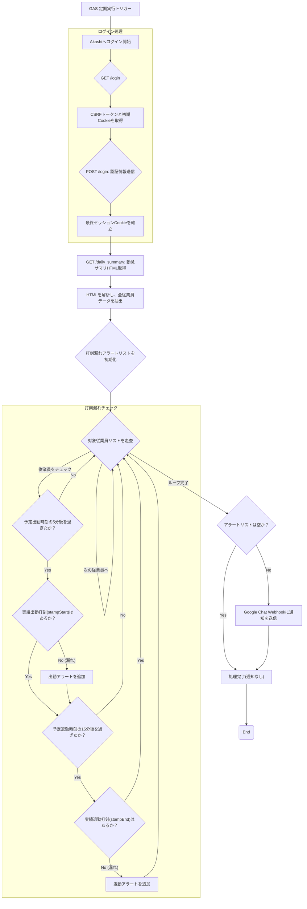

# Akashi勤怠チェック自動化スクリプト 基本設計書

## 1. 概要

本スクリプトは、Google Apps Script (GAS) を実行環境とし、Webスクレイピング技術を用いてクラウド勤怠管理システム「Akashi」から従業員の当日の勤怠情報を取得します。取得したデータに基づき、出勤・退勤の打刻漏れをチェックし、Google ChatのWebhookを通じて管理者へリアルタイムに通知することを目的とします。

### 実行環境

* **実行環境:** Google Apps Script (GAS)
* **通信:** `UrlFetchApp` を利用した外部通信
* **通知先:** Google Chat Webhook

---

## 2. 認証周りの仕様 (Akashiログイン)

Akashiのログインは、セッション管理とCSRFトークンを伴う一連のブラウザ操作をシミュレーションすることで行います。

### 2.1 認証情報

認証に必要な情報は、GASの**スクリプトプロパティ**に機密情報として設定され、コード内に直接記述することはありません。

| 項目名 | 用途 | 備考 |
| :--- | :--- | :--- |
| `COMPANY_ID` | 企業ID | ログイン時に使用 |
| `LOGIN_ID` | ログインID | ログイン時に使用 |
| `PASSWORD` | パスワード | ログイン時に使用 |
| `WEBHOOK_URL` | Google Chat Webhook URL | 通知送信先 |

### 2.2 ログインシーケンス

1.  **[GET] ログインページアクセス:** `LOGIN_URL` (`/ja/login`) にアクセスし、レスポンスHTMLから　`authenticity_token` **(CSRFトークン)** を抽出し、**初期セッションCookie**を保持します。
2.  **[POST] ログインフォーム送信:** 取得したCSRFトークンと認証情報をペイロードとして `POST` します。HTTPヘッダーには、保持しているセッションCookieを設定します。
3.  **セッション確立:** リダイレクトヘッダーから**最終セッションCookie**を取得し、以降のデータ取得リクエストで使用します。
4.  **ページ遷移:** セッション安定のため、勤怠サマリページ (`/daily_summary`) の前に中間ページを `GET` でアクセスします。

---

## 3. 勤怠データ抽出・チェックの仕様

確立されたセッションCookieを使用して「日次勤怠サマリ」ページにアクセスし、打刻漏れの判定を行います。

### 3.1 データ抽出 (Webスクレイピング)

* **対象ページ:** 勤怠サマリURL (`https://atnd.ak4.jp/ja/manager/daily_summary`)。**当日**のデータを取得します。
* **抽出方法:** HTML内の勤怠情報を含む `<tr>` タグを正規表現で抽出し、以下の情報をパースします。

| データ項目 | 抽出元 | 備考 |
| :--- | :--- | :--- |
| **氏名** (`name`) | `<td>` (Index 1) | **名字のみ**を抽出し、通知対象の判定に使用 |
| **実績出勤打刻** (`stampStart`) | `<td>` (Index 2) | `HH:MM` または 未打刻時は `--:--` |
| **実績退勤打刻** (`stampEnd`) | `<td>` (Index 2) | `HH:MM` または 未打刻時は `--:--` |
| **勤務状況** (`statusText`) | `<td>` (Index 3) | 年休、半休（午前/午後）、在宅勤務などの情報を含むフリーコメント欄 |
| **予定出勤** (`scheduledStart`) | `<td>` (Index 4) **または** 勤務状況 | Akashiのデフォルト予定時刻。**ただし、勤務状況に「年休」「午前半年休」がある場合は、打刻漏れチェックの基準時間を上書きする。** |
| **予定退勤** (`scheduledEnd`) | `<td>` (Index 4) **または** `<td>` (Index 11) **または** 勤務状況 | Akashiのデフォルト予定時刻。ただし、 1.**Index 11 (理由欄)** に `残業終了=HH:MM` のキーワードがある場合、その `HH:MM` で上書き。2.**勤務状況に「年休」「午後半年休」がある場合は、打刻漏れチェックの基準時間を上書きする。** 上記1, 2のいずれも該当しない場合は Index 4 の値をそのまま使用。 |

```
補足: 予定出勤・予定退勤欄は、(Index 4) の項目が Akashiは以下の仕様になっているための対処。
・年休: 予定出退勤は定時が設定される。
・午前半年休: 予定出勤は実際の出勤予定時刻ではなく通常勤務時の出勤予定時刻が設定される。
・午後半年休: 予定退勤は実際の出勤退勤時刻ではなく通常勤務時の退勤予定時刻が設定される。
・残業: 予定退勤には残業予定時刻は反映されず、通常勤務時の退勤予定時刻が設定される。
```

### 3.2 打刻漏れチェックロジック

チェックは**現在のJST時刻**を基準に行われます。

| チェック項目 | 条件 | 通知トリガー時刻 (現在時刻が基準) | 通知メッセージ |
| :--- | :--- | :--- | :--- |
| **出勤打刻漏れ** | (1) **実績出勤打刻**が `--:--` <br/> (2) **最終的な予定出勤**が `--:--` ではない | 予定開始時刻の **5分前 以降** | 「**出勤**打刻が行われていません」 |
| **退勤打刻漏れ** | (1) **実績退勤打刻**が `--:--` <br/> (2) **最終的な予定退勤**が `--:--` ではない | 予定終了時刻の **15分後 以降** | 「**退勤**打刻が行われていません」 |

#### 3.2.1 年休・半休時の打刻チェック基準の上書き

勤務状況 (`<td>` Index 3) に「年休」または「半休」の記載がある場合、打刻漏れチェックの基準となる予定時刻は以下のように上書きされます。

* **「年休」の場合:**
  * **予定出勤時刻:** `--:--` (終日勤務なし)
  * **予定退勤時刻:** `--:--` (終日勤務なし)
  * **チェック:** この場合、終日勤務予定がないと判断され、打刻漏れチェックは行われません。

* **「午前半年休」の場合:**
  * **予定出勤時刻:** `13:00` (午後から出勤)
  * **予定退勤時刻:** 元の予定退勤時刻、または理由欄の残業終了時刻を適用
  * **チェック:** 13:00以降の実績出勤打刻の有無をチェックします。

* **「午後半年休」の場合:**
  * **予定出勤時刻:** 元の予定出勤時刻を適用
  * **予定退勤時刻:** ``17:30`` (午前中で退勤)
  * **チェック:** 17:30以降の実績退勤打刻の有無をチェックします。

### 3.3 通知対象のフィルタリング

スクリプト内の `TARGET_NAMES` 定数 (名字の配列) を用いて制御します。

* **`TARGET_NAMES` が空:** 全従業員をチェック対象とします。
* **`TARGET_NAMES` に値がある:** リストに含まれる名字の従業員のみをチェック対象とします。

### 3.4 通知処理

打刻漏れが1件以上検出された場合、Google Chat Webhook経由で通知を送信します。通知内容は打刻アラートのヘッダーと、打刻漏れが発生している従業員ごとのメッセージを結合したものです。

---

## 4. 処理フロー

システム全体の処理フローをMermaid形式で示します。



---

## 5. 非機能要件

| 項目 | 内容 |
| :--- | :--- |
| **信頼性** | GASの組み込みリトライ機能を利用し、一時的なネットワークエラーに対応します。連続した実行失敗時は、通知ログを確認し、手動でスクリプトを停止・再開することを想定します。 |
| **性能** | Akashiへのアクセスは原則として1日数十回（またはトリガー設定頻度）とし、システムへの負荷を最小限に抑えます。GASの実行時間は最長5分以内での完了を目指します。 |
| **セキュリティ** | Akashiの認証情報、およびGoogle ChatのWebhook URLは、すべてGASの**スクリプトプロパティ**に設定し、コード内に直接記述することはしません。GASの実行権限は、スクリプトの所有者に限定されます。 |
| **保守性** | 主要な設定値（ID、パスワード、URL、通知対象者リスト）は、コード上部の定数またはスクリプトプロパティに集約します。本スクリプトに関するお問い合わせや仕様変更要望は、**9. お問い合わせ先** までご連絡ください。 |

---

## 6. エラーハンドリング

| フェーズ | 発生しうるエラー | 対応策 |
| :--- | :--- | :--- |
| **ログイン** | 認証情報間違い、Akashi側のURL変更、メンテナンスなどによるアクセス失敗 | `try-catch` で捕捉し、エラーメッセージをGASのコンソールログに出力して処理を中断・終了します。 |
| **データ取得** | Akashi側のHTML構造変更、ネットワークエラーなど | `try-catch` で捕捉し、エラーメッセージをコンソールログに出力して処理を中断・終了します。 |
| **通知** | Webhook URL間違い、Google Chat側の通信エラーなど | `try-catch` で捕捉し、エラーメッセージをコンソールログに出力します。本処理は通知の送信をもって完了とするため、**処理は継続（終了）** します。 |

---

## 7. 運用・実行スケジュール

| 項目 | 内容 |
| :--- | :--- |
| **トリガー** | GASの**時刻指定型トリガー** (`Time-driven trigger`) を使用します。 |
| **実行頻度** | 30分おき、1時間おきなどに1回実行することを想定します。 |
| **監視** | GASの実行履歴とコンソールログを定期的に確認し、スクリプトの成功/失敗を監視します。 |
| **通知タイミング** | 実行頻度と通知トリガー時刻（予定終了の15分後など）には**最大で「実行頻度」分のタイムラグ**が発生します。例えば、実行頻度が1時間おきの場合、打刻漏れ通知は最長で1時間遅れて届く可能性があります。 |

---

## 8. 利用上の重要事項

本スクリプトで残業時の打刻漏れチェックを正確に行うために、従業員の皆様には以下の運用ルールを厳守していただく必要があります。

| 項目 | 内容 |
| :--- | :--- |
| **残業時間の記載ルール** | 理由欄 (Index 11) には、必ず `残業終了=HH:MM` の形式で残業を終える予定時刻を記載してください。形式が崩れた場合（例: `残業終了 20:30` や `20:30残業終わり` など）、スクリプトは時刻を認識できず、**定時終了時刻を基準に**退勤打刻アラートが送信されます。 |
| **フリーコメントへの対応** | 理由欄に「残業終了=HH:MM」のキーワードが含まれていれば、その前後の文章や改行はスクリプトの動作に影響しません。 |
| **GASエラー時の対応** | ログイン情報変更やAkashiのHTML構造変更が発生した場合、スクリプトはエラーで停止します。その際は、**GASのコンソールログ**を確認し、エラー内容に応じてスクリプトプロパティの更新またはコード修正を行う必要があります。 |
| **お問い合わせ・要望** | 本スクリプトに関するお問い合わせや仕様変更のご要望は、**9. お問い合わせ先** までご連絡ください。 |

---

## 9. お問い合わせ先

本スクリプトに関するお問い合わせ、機能追加・変更のご要望は、以下までご連絡ください。

* **担当:** 業務推進部.葭田
* **連絡先チャットID:** @moc_01440
* **連絡先メールアドレス:** t_yoshida@mocweb.co.jp

---
