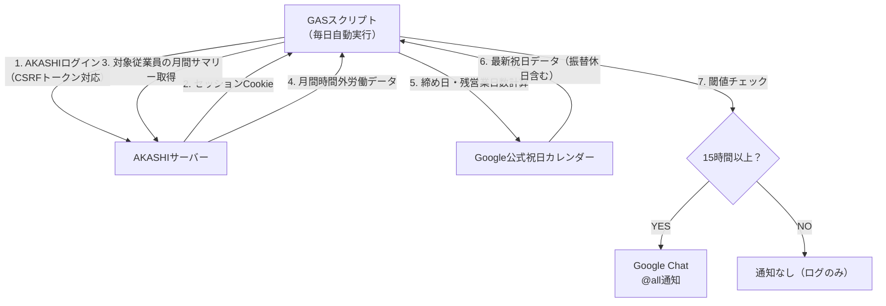

# Akashi月間時間外労働15時間超アラートシステム 基本設計書

---

## 1. 概要

### 1.1. システム名称

**Akashi月間時間外労働15時間超アラートシステム** (Google Apps Script)

### 1.2. 目的

勤怠管理システム**AKASHI**から社員の月間時間外労働（残業、所定休日労働、法定休日労働の合計）を自動で取得し、あらかじめ定義された閾値（15時間）を超過した社員を検知する。超過者を**Google Chat**へ通知することで、管理者のチェック業務の負担軽減と、過重労働の早期発見・是正を促進する。

### 1.3. 最大の特長（メンテナンスフリー設計）

- 日本の祝日・振替休日は**Google公式公開カレンダー**からリアルタイム取得  
→ **2030年以降も手動更新一切不要**で完全自動対応  
- 20日締め・前日基準の締め日自動判定＋残営業日数自動計算  
- セッション切れ時の自動再ログイン対応

### 1.4. 対象範囲

| 項目 | 内容 |
| :--- | :--- |
| **対象システム** | AKASHI（管理者ページ） |
| **実行環境** | Google Apps Script (GAS) |
| **通知先** | Google Chat (Webhook) |
| **対象データ** | 対象社員の指定された年月の**月間残業時間**、**月間所定休日労働時間**、**月間法定休日労働時間** |
| **実行タイミング** | 毎日実行（スクリプトプロパティ `main()` を毎日または毎月25日などに登録） |
| **対応労働制** | 不問（AKASHIから取得する時間外労働合計が対象） |
| **祝日データソース** | Google公式「日本の祝日」カレンダー（リアルタイム更新・メンテ不要） |

---

## 2. システム構成

### 2.1. 構成図（Mermaid）

システムと外部サービスとの連携を以下の図に示します。

---

## 3. 機能設計

### 3.1. 主要機能一覧

| No. | 機能名 | 概要 |
| :--- | :--- | :--- |
| 3.1.1 | 認証情報取得機能 | スクリプトプロパティからAKASHIログイン情報を取得する。 |
| 3.1.2 | AKASHIログイン機能 | 認証情報とCSRFトークンを用いてAKASHIにログインし、セッションCookieを維持する。 |
| 3.1.3 | 対象年月決定機能 | 実行日（JST）が22日以降の場合、チェック対象を翌月とする。 |
| 3.1.4 | 月間サマリーデータ取得機能 | 対象従業員ID、対象年月に基づき、管理者ページから月間の勤怠サマリーデータ（Ajaxレスポンス）を取得する。 |
| 3.1.5 | 月間時間外労働解析機能 | 取得したAjaxレスポンステキストから、「月間残業時間」「月間所定休日労働時間」「月間法定休日労働時間」を抽出し、合計時間を分単位で算出する。 |
| 3.1.6 | 閾値チェック機能 | 算出した合計時間外労働が、設定された閾値（15時間）を超過しているかチェックする。 |
| 3.1.7 | 残営業日数自動計算機能 | 20日締め・前日基準で締め日自動判定・Google公式祝日カレンダーから土日祝を除外・振替休日も自動反映 |
| 3.1.8 | 通知機能 | 閾値超過者がいる場合は、その社員名と合計時間外労働時間をGoogle Chatに通知する。該当者がいない場合はその旨をログに出力する。 |

### 3.2. 時間外労働チェック詳細

スクリプトで実装されている主な時間外労働チェック項目と内容を以下に示します。

| No. | チェック内容 | 判定条件 | 通知メッセージ例 |
| :--- | :--- | :--- | :--- |
| 1 | **月間時間外労働15時間超過** | 「月間残業時間」「月間所定休日労働時間」「月間法定休日労働時間」の合計が **15**時間以上である。 | 【月間時間外労働15時間以上アラート】YYYY年M月  氏名 さん → HH:MM  ※残業＋所定休日労働＋法定休日労働の合計です  【残営業日情報】 締め日 YYYY/MM/DD までの残営業日日数は N日です。 未申請で閾値超過の可能性があれば、速やかに申請してください。|

---

## 4. データ設計

### 4.1. 勤怠データ構造

GASスクリプト内で解析・利用される時間外労働データは以下の通りです。

| 項目名 | 型 | 説明 |
| :--- | :--- | :--- |
| 月間残業時間 | string | AKASHIから取得する月間の残業時間 (h:mm) |
| 月間所定休日労働時間 | string | AKASHIから取得する月間の所定休日労働時間 (h:mm) |
| 月間法定休日労働時間 | string | AKASHIから取得する月間の法定休日労働時間 (h:mm) |

### 4.2. 設定データ (スクリプトプロパティ)

本システム実行に必須の外部設定情報です。

| プロパティ名 | 用途 | 必須/任意 | 備考 |
| :--- | :--- | :--- | :--- |
| `COMPANY_ID` | AKASHIログイン用の企業ID | 必須 | |
| `LOGIN_ID` | AKASHIログイン用の管理者ログインID | 必須 | |
| `PASSWORD` | AKASHIログイン用のパスワード | 必須 | |
| `CHAT_WEBHOOK_URL` | Google Chatへの通知用Webhook URL | 必須 | |
| **CalendarApp権限** | 日本の祝日カレンダーアクセス | 必須 | 初回実行時に許可が必要 |

---

## 5. 実行環境・設定

### 5.1. 実行環境

* **プラットフォーム**: Google Apps Script (GAS)
* **言語**: JavaScript (ES5/6 相当)
* **外部サービス**: UrlFetchApp, PropertiesService, Utilities, CalenderApp

### 5.2. 初期設定手順

1.  **GASのデプロイ**: 提供されたスクリプトをGASエディタにコピー＆ペーストします。
2.  **定数設定**: スクリプト内の`TARGET_EMPLOYEE_IDS`に対象従業員IDの配列を設定します。
3.  **スクリプトプロパティ設定**: GASエディタのプロジェクト設定またはスクリプトプロパティ画面から、以下の4つのプロパティを設定します。
      * `COMPANY_ID`
      * `LOGIN_ID`
      * `PASSWORD`
      * `CHAT_WEBHOOK_URL`
4. **初回のみ：** メニューから main() を手動実行。「Googleカレンダーへのアクセスを許可しますか？」と出るので 許可
5.  **トリガー設定**: 毎日決まった時間（例: 業務時間終了後）に`main`関数が実行されるよう、時間ベースのトリガーを設定します。（毎週月曜から金曜に限定したい場合は、曜日ごとに5つのトリガーを設定するか、スクリプト内で曜日チェックを実装してください。）

---

## 6. 運用・保守

### 6.1. ログ管理

* GASの実行ログ (`Logger.log`) を使用し、ログイン成否、エラー発生時の詳細情報、処理の進捗を記録します。
* エラー発生時やログイン失敗時は、Google Chatにも通知されます。

### 6.2. メンテナンス

* AKASHIのHTML構造やログインフロー、APIエンドポイントが変更された場合、スクリプトの改修が必要となります。
* 時間外労働の閾値や通知内容は、スクリプト内の定数および`main`関数内のロジックを更新することで変更可能です。
* 日本の祝日は、Google公式カレンダー自動取得するため、手動更新不要です。

### 6.3. セキュリティ

* AKASHIの認証情報は、スクリプト本体ではなく**スクリプトプロパティ**に安全に保存されます。
* AKASHIへのリクエストは、遅延 (`addRandomDelay`) を挿入し、サーバーへの過負荷やスクレイピングと見なされるリスクを軽減しています。
* 機密情報（パスワードなど）はログに出力されません。

---

## 7. お問い合わせ先

本スクリプトに関するお問い合わせ、機能追加・変更のご要望は、以下までご連絡ください。

* **担当:** 業務推進部.葭田
* **連絡先チャットID:** @moc_01440
* **連絡先メールアドレス:** t_yoshida@mocweb.co.jp

---
