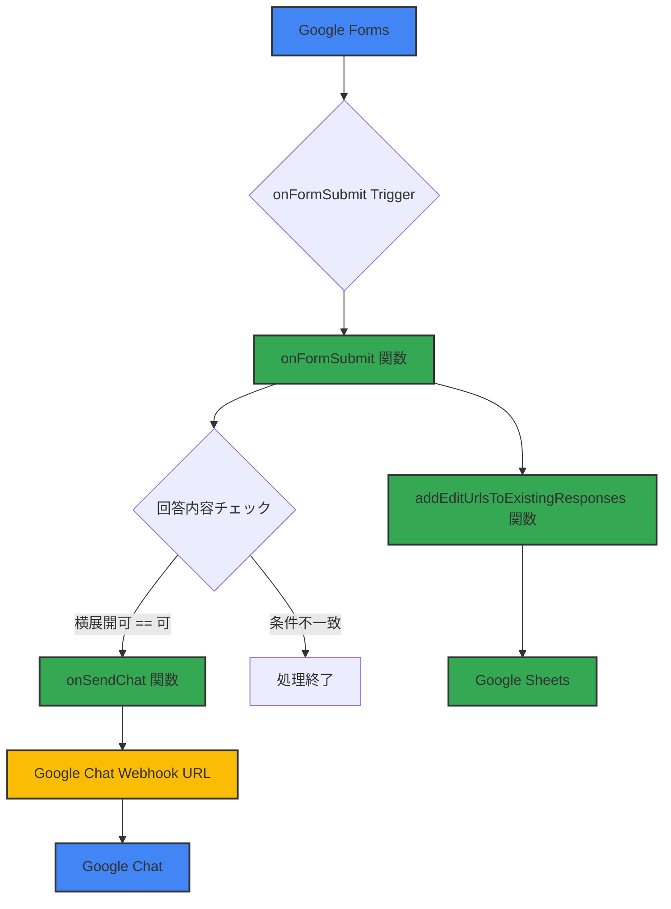

# Google Forms 回答自動化システム 基本設計書

## 1. はじめに

### 1.1. システム概要
本システムは、Google Apps Script を用いて、Googleフォームの回答内容と Google Chat を連携させる自動化システムである。フォームの回答内容をリアルタイムで分析し、特定の条件を満たした場合に Google Chat に通知を行う。また、フォームの回答編集URLをスプレッドシートに自動で記録する機能も有する。

### 1.2. 運用管理方針

本スクリプトは Google フォームに内包（コンテナバインド）されている。管理者の異動時は、フォームの所有権移転および実行権限（トリガー）の再設定が必須となる。

## 2. 機能要件

### 2.1. 機能一覧
| ID | 機能名称 | 概要 | 実行タイミング |
|---|---|---|---|
| FN-01 | フォーム回答トリガー | Googleフォームの回答送信時に、主処理を起動する。 | フォーム回答時 |
| FN-02 | 条件判定処理 | 回答内容のうち、特定の質問項目と回答をチェックする。 | 回答取得後 |
| FN-03 | Google Chat通知 | 条件が満たされた場合に、Google Chatに通知を送信する。 | 条件判定後 |
| FN-04 | 編集URL記録 | フォーム回答の編集URLをスプレッドシートに記録する。 | 回答取得後 |
| FN-05 | 固定メッセージ投稿 | 事前に定義された固定メッセージをGoogle Chatに投稿する。 | 手動または定期実行 |

### 2.2. 機能詳細

#### FN-01, FN-02, FN-03: Google Chat通知機能

* **判定ロジック:** 質問「横展開可否」で始まる項目の回答が「可」の場合のみ `onSendChat(e)` を実行。
* **通知内容:** `targetQuestions` で定義された項目を抽出し、Webhook経由で送信。
* **設定値:** Webhook URLおよびスプレッドシートIDは、スクリプトプロパティから取得する。

#### FN-04: 編集URL記録機能

* フォーム回答と同時に `addEditUrlsToExistingResponses()` を実行。
* スプレッドシート（プロパティ：`BPICHIRAN_FILE_ID`）のシート「フォームの回答 1」に対し、編集URLを追記する。

## 3. 連携システム

### 3.1. 使用サービス

* **Google Forms**: 回答データソース
* **Google Sheets**: 回答編集URLの記録先（BP情報一覧）
* **Google Chat**: Webhookによる通知送信先

### 3.2. スクリプトプロパティ

引き継ぎ時は以下のプロパティが正しく設定されているか確認すること。

| プロパティ名 | 内容 |
| --- | --- |
| `CHAT_OUTER_WEBHOOKURL` | 通知用Google Chat Webhook URL |
| `BPICHIRAN_FILE_ID` | 記録先スプレッドシートのID |
| `BPICHIRAN_URL` | 通知メッセージに記載する一覧のURL |
| `BP_FORM_URL` | 通知メッセージに記載するフォームのURL |

## 4. 構成図

## 5. 管理・引き継ぎ手順（重要）

管理者が交代する場合、以下の手順を必ず実施すること。

### 5.1. 所有権の譲渡

1. Google フォームの「共同編集者を追加」から、後任者のアカウントを追加し「オーナー」に変更する。
2. スプレッドシート（BP情報一覧）についても、後任者に「編集者」以上の権限を付与する。

### 5.2. トリガーの再設定

トリガーは「設定したユーザー」の権限で動作する。前任者の権限が消失するとシステムが停止するため、後任者のアカウントで以下の設定を行う。

1. **既存トリガーの削除**: 前任者が作成したトリガーをすべて削除する。
2. **新規トリガーの作成**:
* **関数 onFormSubmit**: イベントの種類を「フォーム送信時」に設定。
* **関数 postMessageToChat**: イベントの種類を「時間主導型（月単位など）」に設定。

3. **承認**: 設定時に表示される「権限を承認」のポップアップを後任者のアカウントで許可する。

### 5.3. 動作確認

* フォームにテスト回答を行い、Google Chatへの通知およびスプレッドシートへのURL追記が正常に行われるか確認する。

## 6. 補足事項

* **実行制限**: Google Apps Scriptの仕様により、メール送信やURL取得に制限がかかる場合がある。
* **メンテナンス**: フォームの質問タイトルを変更した場合、コード内の `targetQuestions` の修正が必要になる可能性がある。
