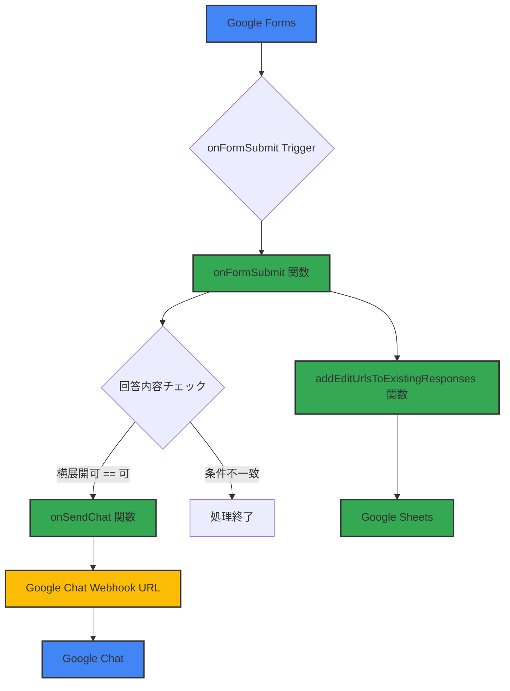

# Google Forms 回答自動化システム 基本設計書

## 1. はじめに

### 1.1. システム概要
本システムは、Google Apps Script を用いて、Googleフォームの回答内容と Google Chat を連携させる自動化システムである。フォームの回答内容をリアルタイムで分析し、特定の条件を満たした場合に Google Chat に通知を行う。また、フォームの回答編集URLをスプレッドシートに自動で記録する機能も有する。

## 2. 機能要件

### 2.1. 機能一覧
| ID | 機能名称 | 概要 | 実行タイミング |
|---|---|---|---|
| FN-01 | フォーム回答トリガー | Googleフォームの回答送信時に、主処理を起動する。 | フォーム回答時 |
| FN-02 | 条件判定処理 | 回答内容のうち、特定の質問項目と回答をチェックする。 | 回答取得後 |
| FN-03 | Google Chat通知 | 条件が満たされた場合に、Google Chatに通知を送信する。 | 条件判定後 |
| FN-04 | 編集URL記録 | フォーム回答の編集URLをスプレッドシートに記録する。 | 回答取得後 |
| FN-05 | 固定メッセージ投稿 | 事前に定義された固定メッセージをGoogle Chatに投稿する。 | 手動または定期実行 |

### 2.2. 機能詳細

#### FN-01, FN-02, FN-03: Google Chat通知機能
**処理フロー:**
1. Googleフォームが送信されると、`onFormSubmit(e)` 関数がイベントオブジェクト `e` を受け取り起動する。
2. `e.response.getItemResponses()` を使用して、フォームの全回答項目を取得する。
3. 各回答項目をループで確認し、質問のタイトルが **「横展開可否」** で始まるか、かつその回答が **「可」** であるかを判定する。
4. 条件を満たした場合、`onSendChat(e)` 関数を呼び出し、通知処理を実行する。
5. 通知処理完了後、ループを `break` で終了する。

**onSendChat 関数の詳細:**
- **メッセージ生成:**
  - **ヘッダー:** 「横展開「可」が入力されました！ 詳細はBP情報一覧をご確認お願いします。」
  - **本文:** `targetQuestions` 配列で定義された質問（例: 記入者氏名, 対象BPの氏名など）と、それに対応する回答を抽出してメッセージを生成する。
  - **フッター:** BP情報一覧へのURLを追記する。
- **通知処理:**
  - HTTP POSTリクエストを `WEBHOOK_URL` に送信する。
  - 送信形式は `application/json` で、ペイロードは生成されたメッセージを含むJSONオブジェクトとする。
- **エラーハンドリング:**
  - 通信エラーが発生した場合、ログにエラーメッセージを記録する。

#### FN-04: 編集URL記録機能
**処理フロー:**
1. `addEditUrlsToExistingResponses()` 関数が起動する。
2. `FormApp.getActiveForm()` と `SpreadsheetApp.openById()` で、フォームとスプレッドシート（ID: `1-aPpSVwhBAF4DoD1xeydhYDalPS6h6S_WQEtn83ofAw`）を取得する。
3. シート名 **「フォームの回答 2」** のシートを取得し、存在しない場合はログを出力して終了する。
4. ヘッダー行に **「編集URL」** 列が存在するかをチェックし、存在しない場合は最終列の隣に新しく追加する。
5. フォームのすべての回答を取得し、各回答に対して以下の処理を行う。
   - 該当するスプレッドシートの行の「編集URL」セルが空であることを確認する。
   - `response.getEditResponseUrl()` で編集URLを取得し、セルに書き込む。
6. 処理状況をログに記録する。

## 3. 連携システム
- **Google Forms**: 本システムのインプットとなるデータソース。
- **Google Sheets**: フォーム回答および編集URLの出力先。
- **Google Chat**: 通知メッセージの送信先。

## 4. 構成図

## 5. 補足事項
- **実行環境**: Google Apps Script
- **認証**: Googleアカウントによる認証
- **Webhook URL**: 環境に応じて変更が必要。
- **スプレッドシートID/シート名**: 環境に応じて変更が必要。
