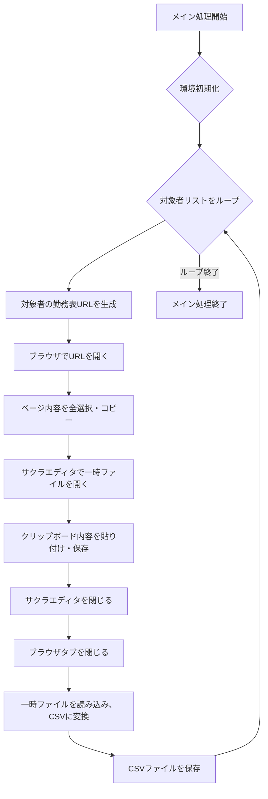

# Akashi勤務表エクスポートスクリプト 利用ガイド＆基本設計書

## 1. はじめに

本ドキュメントは、勤怠管理システム「Akashi」から勤務表データを自動で抽出し、CSVファイルとして保存するためのVBScriptの利用ガイドおよび基本設計書です。本スクリプトは、ブラウザ操作とサクラエディタを連携させることで、手動操作を自動化します。

## 2. 利用ガイド

### 2.1. 動作環境
- **OS**: Windows
- **ブラウザ**: Chrome、Edgeなど
- **エディタ**: サクラエディタ（`SAKURA_PATH` を正しく設定する必要があります）

### 2.2. 前提条件
1. スクリプトを実行するPCに、**サクラエディタ**がインストールされていること。
2. スクリプトの実行前に、**ブラウザでAkashiに管理者アカウントでログイン**しておくこと。
3. `C:\\temp`フォルダが存在すること。存在しない場合は、スクリプトが自動的に作成します。

### 2.3. 設定と実行手順
1. スクリプトの `Const` セクションを確認し、必要に応じて設定を修正してください。
    - `YYYYMM`: 取得したい年月（例: "202509"）。
    - `OUT_PATH`: CSVファイルの出力先フォルダ。
    - `SAKURA_PATH`: サクラエディタの実行ファイル（`sakura.exe`）のフルパス。
2. `g_persons` 配列に、取得したい従業員のユーザーIDをカンマ区切りで入力します。
3. `WScript.exe` を使用して、スクリプトを実行します。

## 3. 基本設計書
### 3.1 処理フロー
本スクリプトの処理フローは、以下の通りです。

### 3.2 ソフトウェア構成

| 区分 | ソフトウェア | 役割 |
|---|---|---|
| スクリプト | VBScript | 全体処理の制御、ブラウザ操作、ファイル操作 |
| ブラウザ | Chrome/Edge | Akashi勤務表の表示とデータ選択・コピー |
| エディタ | サクラエディタ | ブラウザからコピーしたデータを一時ファイルとして保存 |

### 3.3 モジュール設計

スクリプトは以下の主要なサブルーチンと関数で構成されます。

| モジュール名 | 概要 | 役割 |
|---|---|---|
| `Main`| メイン処理 | 全体の流れを制御する。 |
| `InitializeEnvironment`| 環境設定 | 出力フォルダと一時ファイルの存在を確認し、なければ作成する。 |
| `ProcessPersons`| 対象者処理 | `g_persons` リストをループし、各従業員の処理を実行する。 |
| `PerformAkashiExport`| エクスポート処理 | ブラウザを開き、勤務表の全選択・コピー、サクラエディタへの貼り付け・保存を行う。 |
| `ReadAndWriteData`| データ変換 | 一時ファイルを読み込み、不要なデータを削除・整形し、CSV形式で保存する。 |
| `ReplaceSpecificComma`| データ整形 | 特定のカンマを全角カンマに変換し、勤務状況欄を整形する。 |
| `IsJapanese`| 日本語チェック | 文字列が日本語かどうかを判定する。|
| `CleanupEnvironment`| 環境のクリーンアップ | 使用したオブジェクトを解放する。 |

### 3.4 課題

- **ブラウザ操作の不安定性**: `WScript.Sleep` による待機は、PCのパフォーマンスやネットワーク速度に依存するため、安定性に欠けます。
- **サクラエディタへの依存**: スクリプトがサクラエディタに強く依存しており、パスが変更されたり、別PCで実行する場合に調整が必要です。
- **文字コードの問題**: `ADODB.Stream` を使用してUTF-8のファイルを読み込んでいますが、ブラウザやサクラエディタの設定により文字化けが発生する可能性があります。

