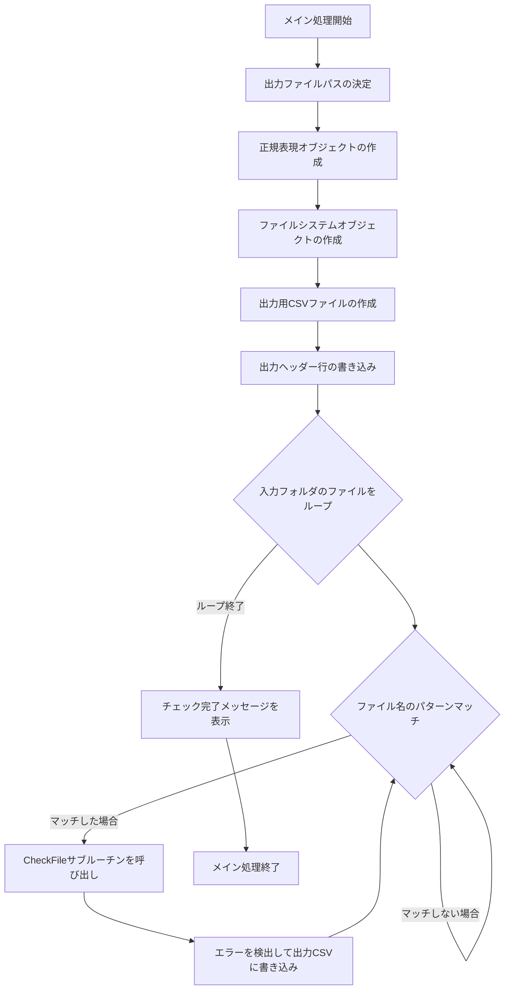

# 勤務表チェックスクリプト 利用ガイド＆基本設計書

## 1. はじめに

本ドキュメントは、勤怠管理システムからエクスポートされたCSVファイルを自動でチェックし、エラー内容を新しいCSVファイルに出力するVBScriptの利用ガイドおよび基本設計書です。

## 2. 利用ガイド

### 2.1. 動作環境
- **OS**: Windows
- **VBScript**: Windows環境に標準で搭載
- **入力ファイル**: 前提として、Akashi勤務表エクスポートスクリプト (`akashiCsv2.vbs`) によって生成された `勤務表_*.csv` ファイルが、指定されたフォルダに存在する必要があります。

### 2.2. 前提条件
1. スクリプトを実行するPCに、**Akashi勤務表エクスポートスクリプト**が正常に実行され、チェック対象のCSVファイルが用意されていること。
2. スクリプトの `inputFolder` で指定されたフォルダがPC上に存在すること。

### 2.3. 設定と実行手順
1. スクリプトの `Const` セクションを確認し、必要に応じて設定を修正してください。
    - `targetMonth`: チェックしたい年月（例: "202509"）。
    - `inputFolder`: チェック対象のCSVファイルが格納されているフォルダ。
2. スクリプトを実行します。エラーが検出された場合、`inputFolder` に `勤怠指摘事項_YYYYMM.csv` が自動的に生成されます。

## 3. 基本設計書

### 3.1. 処理フロー

本スクリプトの処理フローは以下の通りです。

### 3.2. ソフトウェア構成

| 区分 | ソフトウェア | 役割 |
|---|---|---|
| スクリプト | VBScript | 全体処理の制御、ファイル操作 |
| ファイル | CSV | 入力ファイル（勤務表）、出力ファイル（エラー指摘事項） |

### 3.3. モジュール設計

スクリプトは以下の主要なサブルーチンと関数で構成されます。

| モジュール名 | 概要 | 役割 |
|---|---|---|
| `Main` | メイン処理 | スクリプトの全体フローを制御し、ファイル操作を実行する。 |
| `CheckFile` | ファイルチェック | 個別の勤務表CSVファイルを読み込み、行ごとにチェックを実行する。 |
| `IsTime` | 時刻形式チェック | 文字列が有効な時刻形式であるかを判定する。 |
| `TimeToMinutes` | 時刻変換 | "HH:MM"形式の文字列を分単位の数値に変換する。 |
| `MinutesToTime` | 分変換 | 分単位の数値を "HH:MM" 形式の文字列に変換する。 |
| `CheckReason` | 理由記載チェック | 理由欄に所定のキーワードが含まれているかを判定する。 |

## 4. チェック仕様

スクリプトが実行する具体的なチェック項目は以下の通りです。

### 4.1. 打刻関連のチェック
| No. | チェック内容 | エラー出力条件 |
|---|---|---|
| **1** | **打刻忘れ** | 打刻（出/退）がなく、かつ理由欄に適切な理由が記載されていない。 |
| **5** | **打刻と実績の乖離** | 出勤/退勤の打刻時間と実績時間の乖離が30分以上あり、かつ理由欄に適切な理由が記載されていない。 |

### 4.2. 勤務状況・理由欄のチェック
| No. | チェック内容 | エラー出力条件 |
|---|---|---|
| **3** | **遅刻理由の不備** | 勤務状況が「遅刻」であり、かつ理由欄に適切な理由が記載されていない。 |
| **4** | **退勤時間前打刻** | 退勤予定時間より前に打刻されており、かつ理由欄に適切な理由が記載されていない。 |
| **9** | **在宅勤務の記載** | 理由欄に「在宅勤務」とあるが、勤務状況に「在宅勤務」と記載されていない。 または、勤務状況が「在宅勤務」だが、理由欄に「出社」「出勤」「移動」とある。 |
| **11** | **遅刻理由の記載** | 勤務状況が「遅刻」で、かつ遅刻時間があるが、理由欄に遅刻理由が記載されていない。 |
| **13** | **早退理由の記載** | 勤務状況が「早退」で、かつ早退時間があるが、理由欄に早退理由が記載されていない。 |
| **15** | **電車遅延** | 勤務状況に「電車遅延」があるにもかかわらず、実績出勤時間が予定と同一、または「遅刻」が同時に含まれている。 |
| **16** | **残業理由と指示者** | 残業時間があるにもかかわらず、理由欄に「理由」「指示」などのキーワードが含まれていない。 |
| **22** | **振替出勤の理由** | 勤務状況が「振替出勤」であるにもかかわらず、理由または指示者が記載されていない。 |
| **23** | **振替休日の日付** | 勤務状況が「振替休日」であるにもかかわらず、理由欄に振替元の年月日が記載されていない。 |
| **24** | **休日出勤の理由** | 勤務状況が「休日出勤」であるにもかかわらず、理由または指示者が記載されていない。 |
| **26** | **代休の日付** | 勤務状況が「代休」であるにもかかわらず、代休元の年月日が記載されていない。 |
| **27** | **有給と在宅の併用** | 勤務状況に「年休」（半休を除く）と「在宅勤務」が同時に記載されている。 |

### 4.3. 勤務時間関連のチェック
| No. | チェック内容 | エラー出力条件 |
|---|---|---|
| **10** | **休憩時間不足** | 実働時間が6時間超で休憩が45分未満、または実働時間が8時間超で休憩が60分未満。 |
| **12** | **遅刻時の休憩修正** | 遅刻時間が3時間以上で、休憩時間が30分を超えている（休憩時間が遅刻として換算されている可能性がある）。 |
| **14** | **早退時の休憩修正** | 早退時間が4時間以上で、休憩時間が30分を超えている（休憩時間が早退として換算されている可能性がある）。 |
| **19** | **半日休暇時の残業** | 「午前半年休」または「午後半年休」であるにもかかわらず、残業時間がある。 |
| **20** | **半日休暇時の休憩** | 「午前半年休」または「午後半年休」であるにもかかわらず、休憩時間が45分以上ある。 |

---
**参考:**

- **CheckReason関数**: 理由欄が空欄または定型文でない場合に false を返します。具体的には、「理由」「ため」「為」「基づく」「会議」「による」のいずれも含まれていない場合にエラーとします。

---

