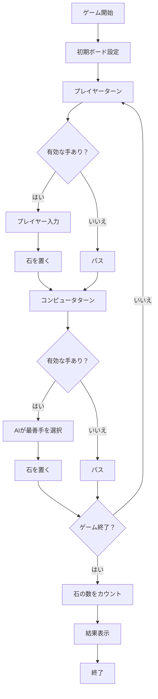
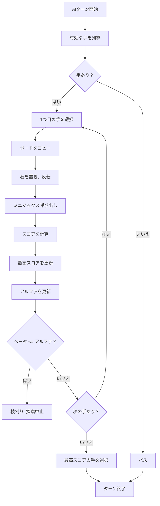

# オセロゲーム設計書

## 概要
このプロジェクトは、8x8のボードでプレイヤー（黒）とコンピュータ（白）が対戦するオセロゲームです。プレイヤーはキーボード入力で石を置き、コンピュータはアルファベータ枝刈り付きミニマックスアルゴリズムを使用して最適な手を選択します。ゲームはコンソールベースで、Python 3.xで実装されています。

- **開発言語**: Python 3.x
- **ライセンス**: MIT License
- **主な機能**:
  - プレイヤー対コンピュータの対戦。
  - アルファベータ枝刈り付きミニマックスによるAI。
  - コンソールでのボード表示と石の数表示。
  - ゲーム終了時の勝敗判定。

## ゲームルール
- **ボード**: 8x8のマス（64マス）。
- **石**: プレイヤー（黒: `@`）、コンピュータ（白: `O`）、空マス（`.`）。
- **ルール**:
  - プレイヤーとコンピュータが交互に石を置く。
  - 石を置く際、相手の石を少なくとも1つ以上挟む必要がある。挟まれた石は自分の石に反転。
  - 有効な手がない場合、パス。
  - 両者がパスするか、ボードが埋まるとゲーム終了。石の多い方が勝利。
- **入力形式**: 例: `d3`（列d、行3に石を置く）。`exit`でゲーム終了。

## ゲームフロー
以下のフローチャートは、ゲームの進行を表します。



## プログラム構造図
プログラムは以下の主要な関数で構成されています。各関数の役割を簡潔に説明します。
| 関数名 | 役割 |
| --- | --- |
|main() |ゲームのメインループ。ターン管理と終了判定を行う。|
|draw_board(board) |8x8ボードをコンソールに表示（例: `1|
|display_game_state(board) |ボードと石の数を表示。|
|handle_player_turn(board) |プレイヤーの入力を受け取り、石を置くかパスを処理。|
|handle_computer_turn(board) |AIが最善手を選択し、石を置くかパスを処理。|
|flip_stones(board, row, col, stone) |指定位置に石を置き、挟まれた石を反転。|
|get_valid_moves(board, stone) |有効な手のリストを返す（例: [(2, 3), (3, 4)]）。|
|evaluate_board(board) |ボードを評価し、スコアを計算（角、着手可能数、石の数を考慮）。|
|minimax(board, depth, is_maximizing, alpha, beta) |アルファベータ枝刈り付きミニマックスで手を評価。|
|find_best_move(board, stone, depth) |最善手を選択（minimaxを呼び出し）。|

### AI思考ロジック
コンピュータ（白）は、アルファベータ枝刈り付きミニマックスアルゴリズムを使用して最善手を選択します。以下で、コードを見なくても直感的に理解できるように、AIの思考プロセスを説明します。

#### ミニマックスアルゴリズムとは
- **目的**: コンピュータが「自分にとって最も有利な手」を選ぶ。
- **考え方**:
  - すべての有効な手を試し、それぞれの手がゲームの未来（数手先）でどんな結果になるかを予測。
  - コンピュータは「自分のスコアを最大化」する手を選択。
  - プレイヤーは「コンピュータのスコアを最小化」する手を選択すると仮定。
  - 最終的に、コンピュータにとって最も高いスコア（良い結果）をもたらす手を選ぶ。
- **深さ**: 最大5手先まで探索（MINIMAX_DEPTH = 5）。

#### 評価基準（スコアの計算）
各ボード状態を以下の基準でスコア化（高いほどコンピュータに有利）：
1. 角の占有:
  - 角（例: a1, a8, h1, h8）に石を置くと、+25点（コンピュータ）または-25点（プレイヤー）。
  - 理由: 角は反転されないため、戦略的に重要。
2. 着手可能数:
  - コンピュータの有効な手が多いほど、+5点/手。プレイヤーの手が多いと、-5点/手。
  - 理由: 手の多さは選択肢の広さを示し、優位性につながる。
3. 石の数:
  - コンピュータの石の数 - プレイヤーの石の数を加算。
  - 理由: 最終的な勝敗は石の数で決まる。

例: コンピュータが角2つを占有（+50）、着手可能数がプレイヤーより2つ多い（+10）、石の数が2つ多い（+2）→ スコア = 50 + 10 + 2 = 62。

#### アルファベータ枝刈り
- **問題**: ミニマックスはすべての手を調べるため、時間がかかる（例: 5手先で6手/ターンなら6⁵=7,776通り）。
- **解決策**: アルファベータ枝刈りで「明らかに悪い手」をスキップ。
- **仕組み**:
  - **アルファ**: コンピュータが確保できる最低のスコア（例: 「少なくとも50点は得られる」）。
  - **ベータ**: プレイヤーが許容する最高のスコア（例: 「50点以上は許さない」）。
  - ある手で「プレイヤーが50点以上を許さない（ベータ=50）」のに、コンピュータが「50点以上を確保できる（アルファ=50）」とわかったら、それ以上の探索は不要（枝刈り）。
- **効果**: 探索する手を大幅に削減（例: 7,776 → 数百程度）。1秒以内に最善手を決定可能。

#### AIの思考プロセス（例）
1. **有効な手を列挙**:
  - 例: c4, d5, e3（[(2, 3), (3, 4), (4, 2)]）。
2. **各手を試す**:
  - c4に石を置いた場合:
    - ボードをコピーし、c4に白石を置き、挟まれた黒石を反転。
    - 5手先までシミュレーション（プレイヤーの最善手も考慮）。
    - スコア計算: 例: 50点。
  - d5、e3も同様に評価（例: 30点、60点）。
3. **最善手を選択**:
  - 最高スコア（60点）の手（e3）を選ぶ。
4. **枝刈り**:
  - e3でスコア60を確保（アルファ=60）。別の手でプレイヤーが50以下に抑えられるとわかったら、探索を中止。

以下のフローチャートは、AIの思考プロセスを表します。



## フォルダ構成
リポジトリの構造は以下の通りです。
```
/takeshiyoshida76/
├── src/
│   └── othello.py         # メインスクリプト
├── docs/
│   └── オセロゲーム設計書 # この設計書
└── LICENSE               # MITライセンス
```

## インストールと実行
1. Python 3.xをインストール。
2. メインスクリプトをダウンロード
3. ゲーム実行
```bash
python othello.py
```

## ライセンス
MIT License（詳細は LICENSE ファイル参照）。コードの再利用や改変は自由ですが、著作権表示を保持してください。

