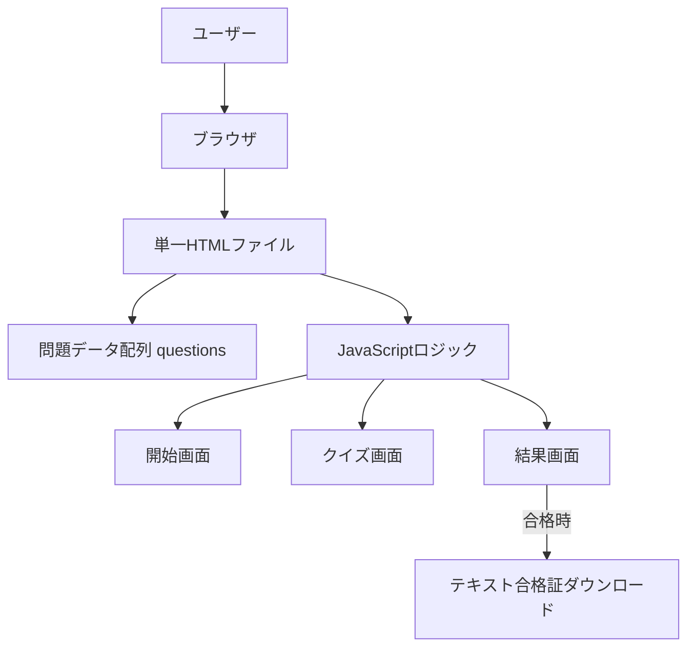
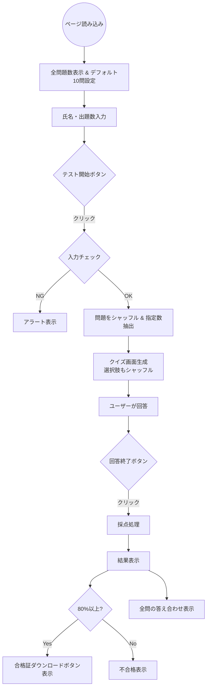

# 基本設計書  
ミニテスト（ブラウザ単体クイズ）

## 1. 概要

ブラウザ上で動作する静的HTML + JavaScriptのみの単一ファイルクイズアプリケーション。  
氏名入力 → 出題数選択 → ランダム出題 → 採点 → 結果表示 → （合格時）簡易合格証ダウンロード。

## 2. システム構成図

## 3. データフロー

## 4. 主要機能一覧

| No | 機能                     | 概要                                                                 |
|----|--------------------------|----------------------------------------------------------------------|
| 1  | 問題データ               | JSON形式の配列 `questions` に問題・選択肢・正解を定義                |
| 2  | ランダム化               | Fisher-Yatesシャッフルを使用（`shuffle()`関数）                     |
| 3  | 出題数選択               | 1〜全問題数の範囲でユーザーが指定（デフォルト10問）                 |
| 4  | 問題表示                 | 単一選択（radio）/複数選択（checkbox）を自動判定                     |
| 5  | 採点ロジック             | 単一選択：完全一致 / 複数選択：完全一致（順不同）                   |
| 6  | 合格判定                 | 正答率80%以上（切り上げ）で合格                                     |
| 7  | 結果表示                 | 得点・合格/不合格・全問の正誤・答え合わせ                           |
| 8  | 合格証出力               | テキストファイル（BOM付きUTF-8）としてブラウザで開く                 |

## 5. 主な制約・前提

- **インターネット不要**：完全にオフラインで動作（外部リソース参照なし）
- **ブラウザ互換性**：モダンブラウザ（Chrome/Edge/Firefox/Safari最新版）を想定
- **複数選択問題**：正解が配列形式 → 完全一致（順不同）のみ正解
- **合格証**：シンプルなテキストファイル（印刷や画像化はユーザー側で対応）
- iOS Safariでのダウンロードは長押し→コピー推奨の注意書きあり

