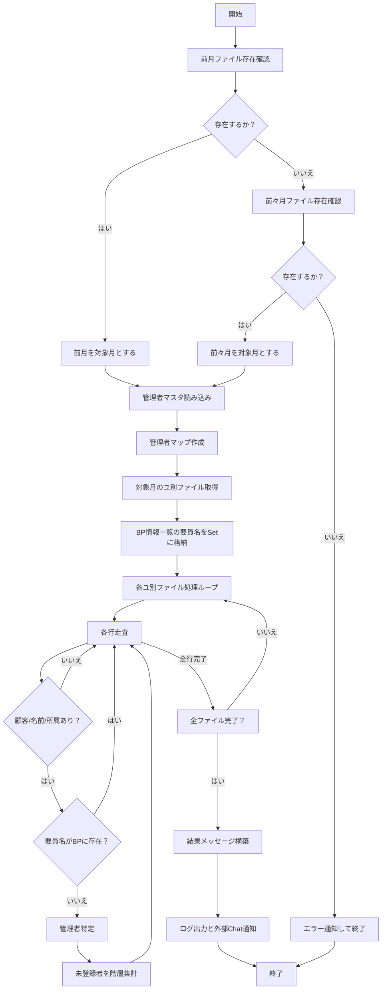
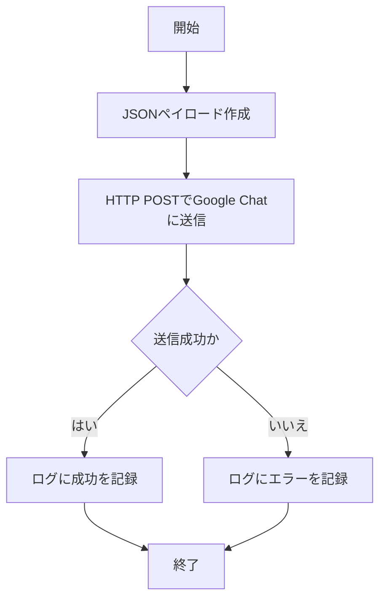
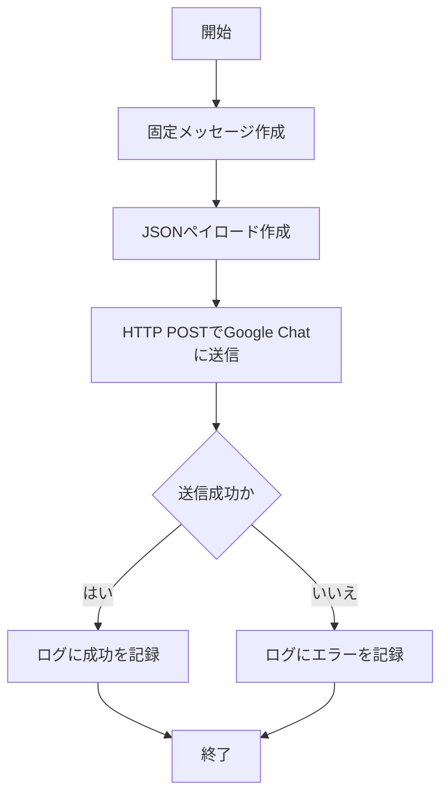
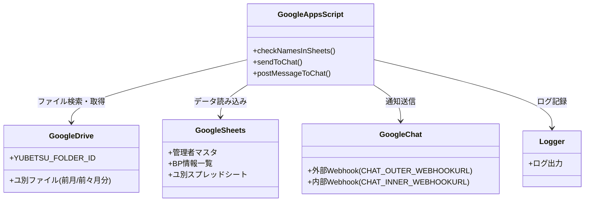

# 基本設計書: ユ別登録チェックおよび通知システム

## 1. システム概要

### 1.1 目的
本システムは、ユ別スプレッドシートに記載された名前がBP情報一覧に登録されているかをチェックし、未登録の名前を管理者単位および顧客・案件単位でグループ化してログ出力およびGoogle Chatに通知する。また、定期的にユ別スプレッドシートの提出を促すメッセージをGoogle Chatに送信する。これにより、データの一貫性を保ち、管理者への迅速な対応を促す。

### 1.2 背景
ユ別データに記載された要員情報が、BP情報一覧に正確に登録されていない場合、業務管理に支障をきたす可能性がある。本システムは、未登録の要員を特定し、管理者に通知することで、データ整合性の向上と業務効率化を図る。

### 1.3 システム範囲
- **対象データ**: ユ別スプレッドシート（前月または前々月分）、管理者マスタ、BP情報一覧
- **処理**: 未登録要員のチェック、グループ化、ログ出力、Google Chat通知
- **定期処理**: ユ別スプレッドシート提出促進メッセージの送信
- **外部連携**: Google Drive、Google Sheets、Google Chat

## 2. 機能要件

### 2.1 ユ別登録チェック機能 (`checkNamesInSheets`)
- **機能概要**: 前月分のユ別ファイルをまず確認、あればチェック。なければ前々月を確認、あればチェック。どちらもなければエラー通知。記載された要員名がBP情報一覧に存在するかチェック。未登録者を管理者および顧客・案件単位で集計し、Google Chatに通知。
- **入力**:
  - ユ別スプレッドシート（売上・支払情報シート）
  - 管理者マスタ（シート1）
  - BP情報一覧（フォームの回答 1）
- **出力**:
  - ログ（Google Apps ScriptのLogger）
  - Google Chat通知（未登録者リストまたは全登録済みメッセージ）
- **処理内容**:
  1. 前月ファイル存在確認 → 存在すれば対象月確定。なければ前々月確認 → 存在しなければエラー通知。
  2. 管理者マスタから顧客名＋案件名および顧客名のみをキーとする管理者マップを作成。
  3. 対象月のユ別ファイルを取得し、各ファイルの名前をBP情報一覧と照合。
  4. ユ別シートのC列（顧客名）が空または金額（数式含む）の場合、1つ上の行の顧客名を前方参照で継承する。
  5. 継承された顧客名を用いて管理者を特定し、未登録の名前を管理者および顧客・案件単位でグループ化。
  6. 結果をログ出力およびGoogle Chatに通知。

### 2.2 Google Chat通知機能 (`sendToChat`)
- **機能概要**: 指定されたメッセージをGoogle ChatのWebhook URLに送信。
- **入力**: Webhook URL、送信メッセージ
- **出力**: Google Chatへのメッセージ送信、ログ出力
- **処理内容**:
  - JSONペイロードを作成し、HTTP POSTリクエストでGoogle Chatに送信。
  - エラー発生時はログに記録。

### 2.3 定期メッセージ投稿機能 (`postMessageToChat`)
- **機能概要**: ユ別スプレッドシートの提出を促す固定メッセージをGoogle Chatに定期送信。
- **入力**: 固定メッセージ、Webhook URL、Google DriveフォルダID
- **出力**: Google Chatへのメッセージ送信、ログ出力
- **処理内容**:
  - 固定メッセージをJSONペイロードとしてGoogle Chatに送信。
  - エラー発生時はログに記録。

## 3. 非機能要件

### 3.1 パフォーマンス
- **処理時間**: ユ別ファイル数およびデータ量に応じて数秒～数分で処理完了。
- **スケーラビリティ**: 複数のユ別ファイル（デジタル推進部、業務推進部など）を処理可能。

### 3.2 可用性
- Google Apps Scriptの実行制限（6分/実行、30分/日）に準拠。
- Google ChatおよびGoogle Driveのサービス可用性に依存。

### 3.3 セキュリティ
- スクリプトプロパティ（`PropertiesService`）に格納された機密情報（フォルダID、Webhook URL）は、スクリプト編集権限を持つユーザーのみにアクセス可能。
- Google ChatのWebhook URLは限定された内部チャットに送信。

### 3.4 エラー処理
- スプレッドシートやフォルダが見つからない場合、エラーメッセージをログとGoogle Chatに出力し処理を終了。
- Google Chat送信エラー時、ログに記録し処理を継続。

## 4. データ構造

### 4.1 ユ別スプレッドシート
- **ファイル名**: `YYYY.MM_ﾃﾞｼﾞﾀﾙ推進部` または `YYYY.MM_業務推進部`（前月または前々月分）
- **シート名**: 売上・支払情報
- **列構成**:
  - A列: 案件名 (`caseNameColumnA`)
  - B列: 個人名 (`nameColumnA`)
  - C列: 顧客名 (`customerColumnA`)
  - E列: 所属 (`departmentColumnA`)

### 4.2 管理者マスタ
- **スプレッドシートID**: `ADMIN_MASTER_FILE_ID`
- **シート名**: シート1
- **列構成**:
  - A列: 顧客名 (`adminCustomerColumn`)
  - B列: 案件名 (`adminCaseNameColumn`)
  - C列: 管理者氏名 (`adminNameColumn`)

### 4.3 BP情報一覧
- **スプレッドシートID**: `BPICHIRAN_FILE_ID`
- **シート名**: フォームの回答 1
- **列構成**:
  - F列: 個人名 (`nameColumnB`)

### 4.4 スクリプトプロパティ

| プロパティ名                  | 用途                          |
|-------------------------------|-------------------------------|
| `YUBETSU_FOLDER_ID`           | ユ別格納フォルダID            |
| `ADMIN_MASTER_FILE_ID`        | 管理者マスタSS ID             |
| `BPICHIRAN_FILE_ID`           | BP情報一覧SS ID               |
| `CHAT_OUTER_WEBHOOKURL`       | 外部Chat通知用Webhook         |
| `CHAT_INNER_WEBHOOKURL`       | 内部Chat（提出促進）用Webhook |
## 5. 処理フロー

### 5.1 ユ別登録チェック機能 (`checkNamesInSheets`)
以下はMermaidによるフローチャートです。

### 5.2 Google Chat通知機能 (`sendToChat`)

### 5.3 定期メッセージ投稿機能 (`postMessageToChat`)

## 6. 構成図

### 6.1 システム構成図

以下は、登場人物（システムコンポーネント、外部サービス、ユーザー）とその関係を示すMermaidのクラス図です。

## 7. 外部システム連携

- **Google Drive**:
  - ユ別ファイルの格納フォルダ（`YUBETSU_FOLDER_ID`）から対象ファイルを検索。
  - ファイル名形式: `{年}.{月}_[部門名]`（例: `2025.09_デジタル推進部`）。
- **Google Sheets**:
  - 管理者マスタ（`ADMIN_MASTER_FILE_ID`）およびBP情報一覧（`BPICHIRAN_FILE_ID`）を読み込み。
  - ユ別スプレッドシートのデータ取得。
- **Google Chat**:
  - Webhook URL（`CHAT_INNER_WEBHOOKURL`）を使用して通知を送信。
  - 未登録者リストまたは全登録済みメッセージを送信。
- **Google Apps Script**:
  - スクリプトプロパティ（`PropertiesService`）で機密情報を管理。
  - `UrlFetchApp`でHTTPリクエストを送信。

## 8. エラー処理

- **スプレッドシート/シート不存在**:
  - エラーメッセージをログとGoogle Chatに出力し、スクリプトを終了。
- **ファイル不存在**:
  - 警告をログに記録し、処理を継続（他のファイルがあれば処理）。
- **データ不正**:
  - 顧客名、名前、所属が空の場合、警告をログに記録し、該当行をスキップ。
  - 名前が「作業者名」「社員数」で始まる行 → スキップ
  - 顧客名が空または金額（数式含む）の場合、1つ上の行の顧客名を継承して処理を継続。
  - 名前または所属が空の場合、警告をログに記録し、該当行をスキップ。
- **Google Chat送信エラー**:
  - エラーをログに記録し、処理を継続。

## 9. 制約・前提条件

- ユ別ファイルは指定フォルダに正しい命名規則で格納されていること。
- 管理者マスタおよびBP情報一覧のシート構造が変更されないこと。
- Google ChatのWebhook URLが有効であること。
- Google Apps Scriptの実行制限（6分/実行、30分/日）に収まるデータ量であること。

## 10. 運用・保守

- **トリガー設定**:
  - `postMessageToChat`は毎月月初に定期実行（例: 毎月7日にトリガー設定）。
  - `checkNamesInSheets`は週次（毎週水曜日）にスケジュール実行。
- **ログ確認**:
  - Google Apps Scriptのログ（`Logger`）で実行状況を確認可能。
- **メンテナンス**:
  - フォルダID、スプレッドシートID、Webhook URLの変更時にスクリプトプロパティを更新。
  - シート構造変更時には列番号定数（`caseNameColumnA`など）を修正。

## 11. テスト項目

- **正常系**:
  - ユ別ファイル、管理者マスタ、BP情報一覧が正しく存在する場合の未登録者検出。対象月の動的決定（9日以前/10日以降）の確認。
  - 全員登録済みの場合のメッセージ出力。
  - 定期メッセージの正常送信。
- **異常系**:
  - フォルダ/ファイル/シートが存在しない場合のエラー処理。
  - 不正データ（空の顧客名や名前）を含む行のスキップ。
  - Google Chat送信エラー時のログ記録。

## 12. 備考

- **開発者**: T.Yoshida
- **依存サービス**: Google Drive, Google Sheets, Google Chat, Google Apps Script
- **制限事項**:
  - Google Apps Scriptの実行時間制限により、大量データ処理時は分割実行が必要な場合がある。

  - Google Chatのメッセージサイズ制限に注意（必要に応じてメッセージを分割）。
