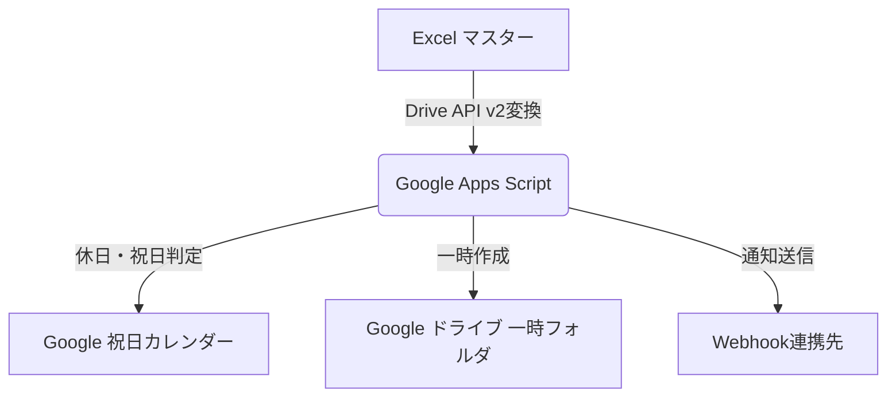
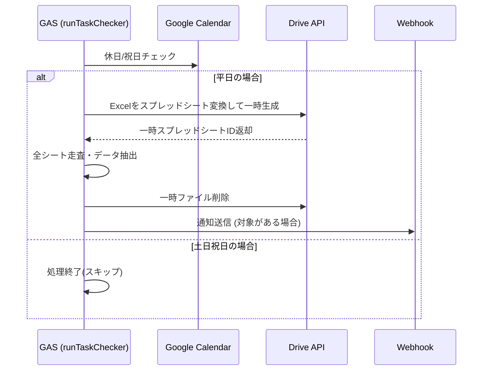

# 勤怠確認事項チェック機能 基本設計書

## 1. 概要

本システムは、Excel形式のマスターファイルを定時スキャンし、勤怠の確認が必要な項目を抽出しWebhook通知を行うツールである。

## 2. システム構成と処理フロー

### 2.1. システム構成図

### 2.2. 処理フロー図

## 3. 入出力仕様

### 3.1. データレイアウト定義

| 項目名 | 列 | 備考 |
| --- | --- | --- |
| 氏名 | B列 |  |
| 日付 | C列 | Date型の場合はM/d形式に整形 |
| 内容 | D列 |  |
| ステータス | E列 | "未対応"または"再確認"が抽出対象 |

### 3.2. 通知フォーマット仕様

通知は以下の形式でWebhook（JSON）送信される。

* **メッセージ全体構造**:
* 1行目: 【勤怠確認事項：対応が必要です】
* 2行目: マスターファイルのGoogleスプレッドシートURL
* 3行目以降: `[シート名] 氏名 : 日付 : 内容 : ステータス` の形式で抽出項目を追記

* **メッセージ本文例**:
`[6月度] 山田 太郎 : 5/26 : 在宅勤務ではないでしょうか。 : 未対応`

## 4. 設計仕様の詳細

### 4.1. データ処理ロジック

* **自動追従機能**: `ss.getSheets()` により、実行時点で存在する全シートを対象として処理を行う。シート増減時の設定変更は不要。
* **休日・祝日判定**:
* `SKIP_HOLIDAYS` が `true` の場合、土日およびGoogle祝日カレンダー上のイベントに基づき処理をスキップする。
* 祝日判定は、当日取得したカレンダーイベントの詳細説明文（`description`）に「祝日」という文字列が含まれているか否かで行う。

* **変換エンジン**: `Drive.Files.create` に `mimeType: MimeType.GOOGLE_SHEETS` を指定し、Excelバイナリをスプレッドシート形式へ変換して処理する。

### 4.2. プロパティによる運用制御

本ツールはスクリプトプロパティを用いて、コードを変更せずに動作を制御する。

| プロパティ名 | 設定値例 | 備考 |
| --- | --- | --- |
| `SKIP_HOLIDAYS` | `true` | trueの場合、祝日・土日は動作停止 |
| `WEBHOOK_URL` | `https://...` | 通知先URL |
| `SPREADSHEET_ID` | `1abc...` | マスターExcel ID |
| `TEMP_FOLDER_ID` | `0Bxx...` | 一時保存フォルダ ID |

## 5. パフォーマンス・非機能要件

* **想定データ量**: 最大20シート、合計5,000行以内。
* **目標実行時間**: 5分以内。

## 6. 運用方針

* **エラーハンドリング**: エラー発生時は処理を停止する仕様。GASの実行ログによる事後特定を基本とする。
* **一時ファイル**: 正常終了時に削除されるが、異常終了時はログ確認後に手動削除する。月次の定期メンテナンスでフォルダのクリーンアップを行う。
