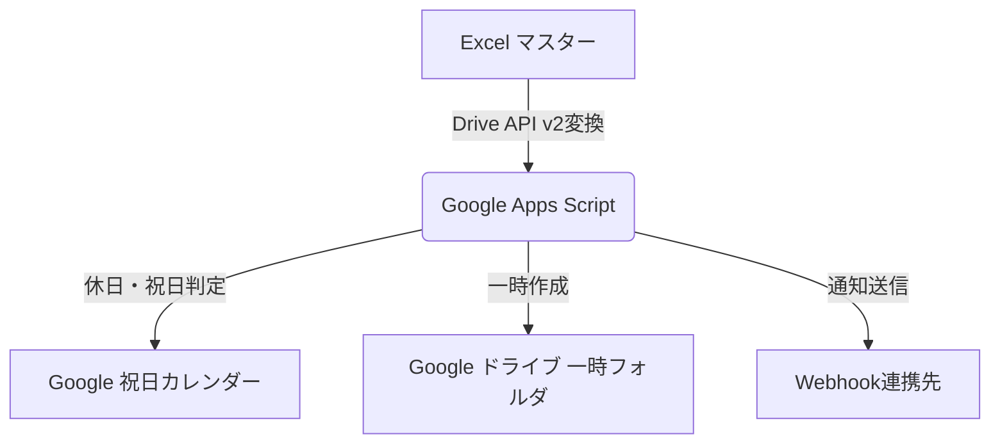
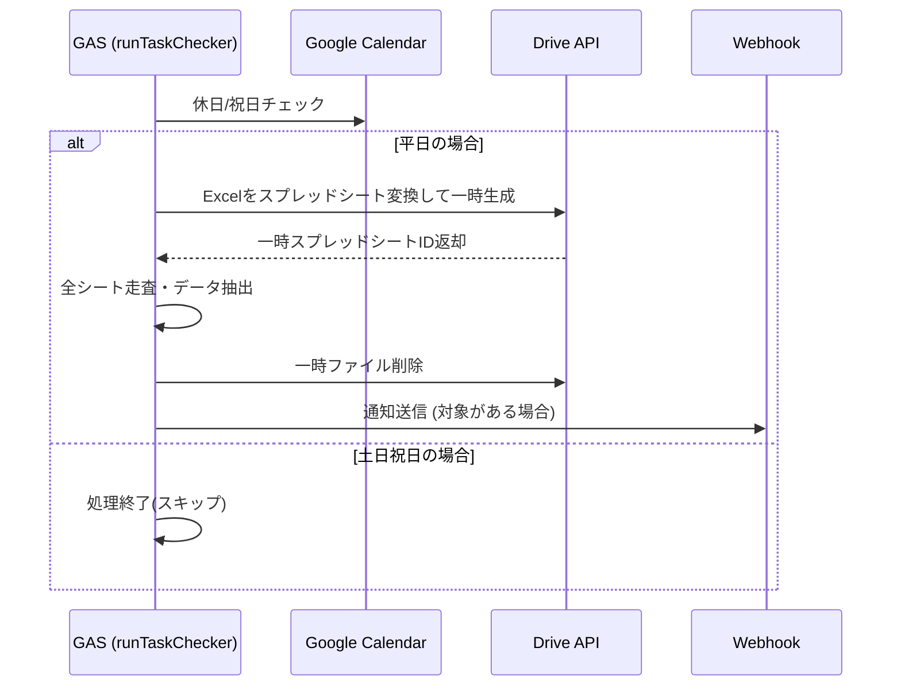

# 勤怠確認事項チェック機能 基本設計書

## 1. 概要

本システムは、Excel形式のマスターファイルを日次でスキャンし、勤怠の確認が必要な項目を抽出してWebhook通知を行うツールである。Google Apps Script（GAS）上で動作する。

## 2. トリガー設計

| 項目 | 内容 |
| --- | --- |
| トリガー種別 | 時間主導型トリガー |
| 起動頻度 | 日次（1日1回） |
| 実行関数 | `runTaskChecker` |

土日・祝日はトリガー自体を止めるのではなく、関数内部の判定（4.2参照）でスキップする方式を採る。これによりトリガー設定をシンプルに保ち、休日判定ロジックの変更をコード側のみで完結させている。

## 3. システム構成と処理フロー

### 3.1. システム構成図

### 3.2. 処理フロー図

## 4. 入出力仕様

### 4.1. データレイアウト定義

| 項目名 | 列 | 備考 |
| --- | --- | --- |
| 氏名 | B列 |  |
| 日付 | C列 | Date型の場合はM/d形式に整形 |
| 内容 | D列 |  |
| ステータス | E列 | "未対応"または"再確認"が抽出対象 |

### 4.2. 通知フォーマット仕様

通知は以下の形式でWebhook（JSON）へ送信される。

- **送信JSON形式**: `{ "text": message }`（`UrlFetchApp.fetch`によるPOST、`contentType: application/json`）
- **メッセージ全体構造**:
  - 1行目: 【勤怠確認事項：対応が必要です】
  - 2行目: マスターファイルのGoogleスプレッドシートURL
  - 3行目以降: `[シート名] 氏名 : 日付 : 内容 : ステータス` の形式で抽出項目を追記
- **メッセージ本文例**:
  `[6月度] 山田 太郎 : 5/26 : 在宅勤務ではないでしょうか。 : 未対応`

対応対象が0件の場合はWebhook送信自体を行わない（無用な通知を避けるための仕様）。

## 5. 設計仕様の詳細

### 5.1. データ処理ロジック

- **自動追従機能**: `ss.getSheets()` により、実行時点で存在する全シートを対象として処理を行う。シート増減時の設定変更は不要。
- **変換エンジン**: `Drive.Files.create` に `mimeType: MimeType.GOOGLE_SHEETS` を指定し、Excelバイナリをスプレッドシート形式へ変換して処理する。
  - **理由**: GASの標準API（SpreadsheetApp等）はxlsxバイナリを直接読み込めないため、一時的にGoogleスプレッドシート形式へ変換する必要がある。処理完了後、一時ファイルは削除する。

### 5.2. 休日・祝日判定ロジック

`SKIP_HOLIDAYS` が `true` の場合、以下の2段階で判定し、いずれかに該当すれば処理をスキップする。

1. **曜日判定**: 実行日が土曜・日曜の場合はスキップ。
2. **祝日判定**: Google日本の祝日カレンダー（`ja.japanese#holiday@group.v.calendar.google.com`）上の当日イベントを取得し、イベントの説明文（`description`）に「祝日」という文字列が含まれる場合のみスキップ。

**判定方式の設計理由**:
Google日本の祝日カレンダーには、国民の祝日以外に「七夕」等の祭日・記念日イベントも登録されている。イベントの有無のみで判定すると、七夕のような対応不要な日まで処理がスキップされてしまう。そのため、イベントタイトルではなく説明文中の「祝日」という文言の有無で判定することで、祝日のみを正確にスキップ対象とし、祭日は通常どおり処理を実行する仕様としている。

### 5.3. 固定仕様（コード内ハードコード値）

以下はプロパティ化せず、コード内に固定値として実装されている。マスターのレイアウトや業務ルールが変わらない前提のもとでの設計判断であり、変更が必要な場合はコード修正が前提となる。

| 項目 | 値 | 備考 |
| --- | --- | --- |
| ステータス列 | E列（インデックス4） | `TARGET_COL_INDEX` |
| 抽出対象ステータス | `未対応`、`再確認` | `TARGET_STATUSES` |
| 祝日カレンダーID | `ja.japanese#holiday@group.v.calendar.google.com` | 変更予定がないため固定 |

## 6. プロパティによる運用制御

本ツールはスクリプトプロパティを用いて、上記5.3以外の環境依存値をコードを変更せずに切り替え可能にしている。

| プロパティ名 | 設定値例 | 備考 |
| --- | --- | --- |
| `SKIP_HOLIDAYS` | `true` | trueの場合、祝日・土日は動作停止 |
| `WEBHOOK_URL` | `https://...` | 通知先URL |
| `SPREADSHEET_ID` | `1abc...` | マスターExcel ID |
| `TEMP_FOLDER_ID` | `0Bxx...` | 一時保存フォルダ ID |

いずれか未設定の場合は`throw new Error(...)`により処理を即時停止する。

## 7. パフォーマンス・非機能要件

- **想定データ量**: 最大20シート、合計5,000行以内。
- **目標実行時間**: 5分以内（GASの実行時間上限は6分のため、それに対する安全マージンとして設定）。

## 8. 運用方針

### 8.1. エラーハンドリング

- 必須プロパティ未設定、Drive API変換失敗などのエラー発生時は、処理を即座に停止する。リトライ処理は実装していない。
- Webhook送信（`UrlFetchApp.fetch`）が失敗した場合もリトライは行わず、GASの実行ログにエラーが記録される形となる。
- エラーの検知・特定は事後のGAS実行ログ確認を基本とする。

### 8.2. 一時ファイルの取り扱い

- 正常終了時、一時変換したスプレッドシートは処理末尾で自動削除される。
- 異常終了時（途中でエラーが発生した場合）は削除処理まで到達せず、一時フォルダにファイルが残る可能性がある。この場合はログ確認後、手動削除で対応する。
- 月次の定期メンテナンスで一時フォルダのクリーンアップを行う。

## 9. 既知の制約

- 祝日判定は説明文の文字列一致（「祝日」を含むか）に依存しており、Googleカレンダー側の記述仕様が変わった場合は判定に影響する可能性がある（対応不要と判断済み・記録として明記）。
- ステータス種別・列位置・祝日カレンダーIDはコード固定のため、マスターのレイアウト変更や祝日カレンダーの切り替えが発生した場合はコード修正が必要となる。
