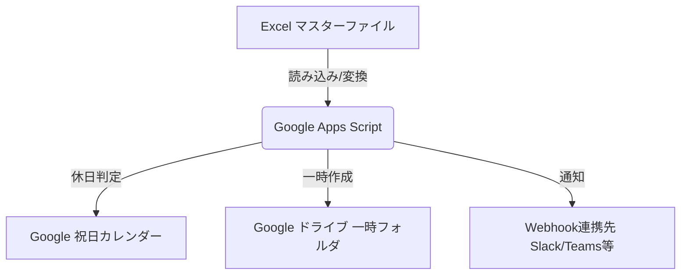
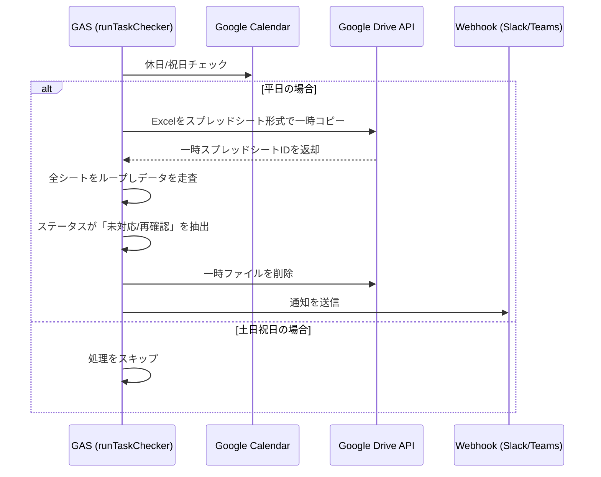

# 勤怠確認事項チェック機能 基本設計書

## 1. 概要

本スクリプトは、Googleドライブ上のExcelマスターを動的に読み取り、勤怠確認事項を自動抽出してWebhook通知を行うツールである。

## 2. システム構成図

GASが外部APIおよびドライブ内のファイルを連携して処理を行う構成です。

## 3. 処理フロー図

自動変換プロセスとデータ抽出の論理フローを示します。

## 4. 設計仕様の詳細

### 4.1. データ処理ロジック

* **自動追従機能**: `ss.getSheets()` により、マスターファイル内のシート追加・削除をリアルタイムに検知します。
* **変換エンジン**: `Drive.Files.create` に `mimeType: MimeType.GOOGLE_SHEETS` を指定することで、Excelのバイナリを変換・読み込み可能な状態へ即時変換します。

### 4.2. プロパティによる運用制御

本ツールはスクリプトプロパティを用いて、コードを変更せずに動作を制御します。

| プロパティ名 | 設定値例 | 備考 |
| --- | --- | --- |
| `SKIP_HOLIDAYS` | `true` | trueの場合、祝日・土日は動作停止 |
| `WEBHOOK_URL` | `https://...` | 通知先URL |
| `SPREADSHEET_ID` | `1abc...` | マスターExcel ID |
| `TEMP_FOLDER_ID` | `0Bxx...` | 一時保存フォルダ ID |

---
