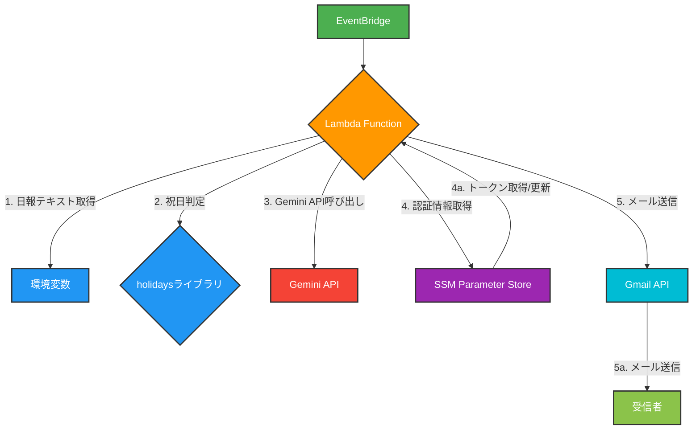
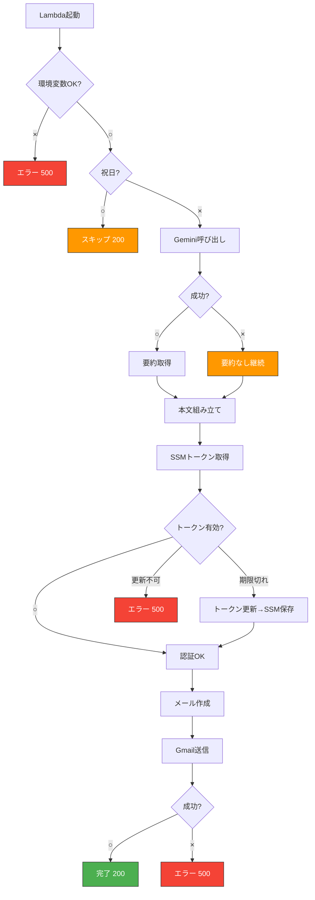

# 日報自動送信処理 基本設計書

## 1. 目的・概要

本ドキュメントは、日報を自動で生成・送信するAWS Lambda関数の基本設計を定義するものです。本処理は、AWS EventBridgeからのイベントをトリガーとし、指定された日報テキストをGmail経由で送信します。また、Google Gemini APIを活用して日報の要約と次へのアクション案を自動生成し、メール本文に付加することで、日報作成の効率化と内容の充実を図ります。

主な機能は以下の通りです。

- **日報メールの自動生成と送信**
- **祝日判定による送信スキップ**

## 2. システム構成

本処理はAWS Lambdaを主体としたサーバーレス構成で動作します。

### 2.1. 構成図



- **構成要素の役割**:
  - **EventBridge**: スケジュールに従いLambdaをトリガーします。
  - **Lambda Function**: 処理の中核であり、日報の生成・送信ロジックを実行します。
  - **環境変数**: メール送信者、宛先、件名、本文などの設定情報を保持します。
  - **holidaysライブラリ**: 日本の祝日を判定し、送信をスキップするかどうかを決定します。
  - **Gemini API**: 日報の要約とアクション案を自動生成します。呼び出し失敗時も処理は継続します。
  - **SSM Parameter Store**: Gmail APIの認証情報を安全に保管・管理します。トークン更新時に自動で上書き保存します。
  - **Gmail API**: 実際にメールを送信するためのGoogleのサービスです。
  - **受信者**: 送信された日報メールを受け取る人です。

## 3. 処理フロー
### 3.1 フローチャート



### 3.2 フローの補足説明
- **Gemini APIはフォールバック設計：** どんな例外でも捕捉し、要約なしで処理継続
- **トークン更新は自動：** 期限切れ時に即座にSSMへ上書き保存
- **改行コード復元：**`EMAIL_BODY`内の `\\n` を `\n` に変換
- **YOUR_NAME未設定時：** デフォルト「氏名」を使用

## 4. データ設計
### 4.1. 環境変数
| 変数名 | 説明 | 形式 | 必須/任意 |
|---|---|---|---|
| SENDER_EMAIL | 送信元メールアドレス | 文字列 | 必須 |
| RECIPIENT_EMAILS | 送信先メールアドレス | 文字列（カンマ区切り可） | 必須 |
| CC_EMAIL | CCメールアドレス | 文字列（カンマ区切り可） | 任意 |
| YOUR_NAME | 日報の差出人名（件名に使用） | 文字列 | 任意 (デフォルト・氏名) |
| EMAIL_BODY | 日報の本文 | 文字列 | 必須 |
| GEMINI_API_KEY | Gemini APIの認証キー | 文字列 | 必須 |

### 4.2. AWS Systems Manager Parameter Store
| パラメータ名 | 説明 | 形式 |
|---|---|---|
| /gmail/token | Gmail APIのOAuth 2.0トークン | JSON文字列（SecureString） |

## 5. エラーハンドリング
| エラーケース | 原因 | 対応策 | 終了コード |
|---|---|---|---|
| 環境変数未設定 | 必須の環境変数が設定されていない | ログ出力 → 500返却 | 500 |
| 祝日 | 実行日が日本の祝日 | ログ出力 → 200返却 (スキップ) | 200 |
| Gemini API呼び出しエラー | APIキーが無効、ネットワークエラー、モデル変更など | ログ出力 → 要約なしで処理継続 | 継続 |
| Parameter Store: パラメータなし | 初回認証未実施 | エラーログ → 例外投げて500返却 | 500 |
| Parameter Store: その他エラー | 権限不足など | ログ出力 → 500返却 | 500 |
| トークンリフレッシュ失敗 | リフレッシュトークン無効化など | ログ出力 → 500返却 | 500 |
| Gmail API送信エラー | ネットワーク、宛先不正など | ログ出力 → 500返却 | 500 |

## 付録A: Geminiプロンプト詳細（参考）

### A.1 使用モデル
- 現在: `gemini-2.5-pro`

### A.2 プロンプトテンプレート（抜粋）
```text
あなたは日報を分析するAIです。
まず、次の5つの分析スタイルのうちどれか1つ、あるいは新しい視点を考え出してください。
・リスク検知（懸念点を洗い出し、対策を提案）
・成果最大化（成功事例を強調し、伸ばす方向を示す）
・チーム連携（人・役割のつながりに注目）
・戦略的思考（今後の展開・優先順位に焦点を当てる）
・自己改善（自分の成長や仕事の進め方の改善に焦点）

出力形式:
要約:
[要約を2〜4行程度にまとめ...]

テーマ:
- [上記テーマを1行で完結に]

アクション案:
- [アクション1]
- [アクション2]
- [アクション3]
```
