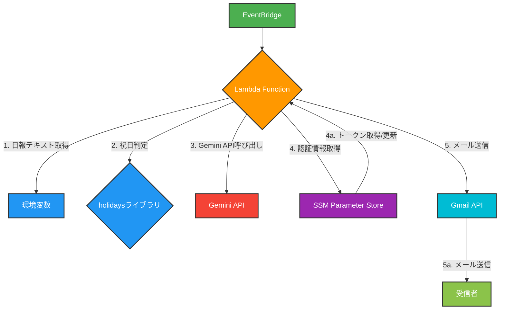
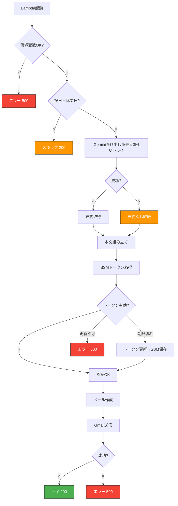

# 日報自動送信処理 基本設計書

## 1. 目的・概要

本ドキュメントは、日報を自動で送信するAWS Lambda関数の基本設計を定義するものです。

本処理は、AWS EventBridgeからのスケジュール実行をトリガーとし、環境変数で指定された日報本文をGmail経由で送信します。

また付加機能として、Google Gemini APIを利用し、日報本文から「要約」と「次のアクション案」を自動生成し、メール本文末尾に付与します。

※ Geminiによる生成処理は補助的な位置づけであり、API障害・失敗時も日報送信処理自体は必ず継続されます。

## 2. システム構成

本処理はAWS Lambdaを主体としたサーバーレス構成で動作します。

### 2.1. 構成図



- **構成要素の役割**:
  - **EventBridge**: スケジュールに従いLambdaをトリガーします。
  - **Lambda Function**: 処理の中核であり、日報の生成・送信ロジックを実行します。
  - **環境変数**: メール送信者、宛先、件名、本文などの設定情報を保持します。
  - **holidaysライブラリ**: 日本の祝日を判定し、送信をスキップするかどうかを決定します。
  - **Gemini API**:   日報本文を入力として、要約およびアクション案を生成します。アクション生成時には、事前に定義された複数の「視点テーマ」からランダムに1つを選択し、思考の軸として与えます。Gemini APIの呼び出しが失敗した場合でも、日報本文のみでメール送信処理は継続されます。
  - **SSM Parameter Store**: Gmail APIの認証情報を安全に保管・管理します。トークン更新時に自動で上書き保存します。
  - **Gmail API**: 実際にメールを送信するためのGoogleのサービスです。
  - **受信者**: 送信された日報メールを受け取る人です。

## 3. 処理フロー
### 3.1 フローチャート



### 3.2 フローの補足説明
- **祝日・休業日判定** 日本の祝日は `holidays` ライブラリで判定に加えて、12月30日〜1月3日は年末年始休暇として送信をスキップ。スキップ時は正常終了（200）とする
- **Gemini APIはフォールバック設計：** 通信エラー、5xx、429、タイムアウト時は自動リトライ、最大2回まで再試行。全失敗時も要約・アクションを付与せず処理継続どんな例外でも捕捉し、要約なしで処理継続
- **トークン更新は自動：** 期限切れ時に即座にSSMへ上書き保存
- **改行コード復元：**`EMAIL_BODY`内の `\\n` を `\n` に変換
- **YOUR_NAME未設定時：** デフォルト「氏名」を使用

## 4. データ設計
### 4.1. 環境変数
| 変数名 | 説明 | 形式 | 必須/任意 |
|---|---|---|---|
| SENDER_EMAIL | 送信元メールアドレス | 文字列 | 必須 |
| RECIPIENT_EMAILS | 送信先メールアドレス | 文字列（カンマ区切り可） | 必須 |
| CC_EMAIL | CCメールアドレス | 文字列（カンマ区切り可） | 任意 |
| YOUR_NAME | 日報の差出人名（件名に使用） | 文字列 | 任意 (デフォルト・氏名) |
| EMAIL_BODY | 日報の本文 | 文字列 | 必須 |
| GEMINI_API_KEY | Gemini APIの認証キー | 文字列 | 必須 |

### 4.2. AWS Systems Manager Parameter Store
| パラメータ名 | 説明 | 形式 |
|---|---|---|
| /gmail/token | Gmail APIのOAuth 2.0トークン | JSON文字列（SecureString） |

## 5. エラーハンドリング
| エラーケース | 原因 | 対応策 | 終了コード |
|---|---|---|---|
| 環境変数未設定 | 必須の環境変数が設定されていない | ログ出力 → 500返却 | 500 |
| 祝日・休業日 | 実行日が日本の祝日、12/30〜1/3 | ログ出力 → 200返却 (スキップ) | 200 |
| Gemini API一時的障害 | 5xx, 429, タイムアウト | 最大2回リトライ（30秒＋ジッタ）| 継続 |
| Gemini API全失敗 | 上記リトライ失敗 | 要約なしで処理継続 | 継続 |
| Parameter Store: パラメータなし | 初回認証未実施 | エラーログ → 例外投げて500返却 | 500 |
| Parameter Store: その他エラー | 権限不足など | ログ出力 → 500返却 | 500 |
| トークンリフレッシュ失敗 | リフレッシュトークン無効化など | ログ出力 → 500返却 | 500 |
| Gmail API送信エラー | ネットワーク、宛先不正など | ログ出力 → 500返却 | 500 |

## 付録A: Gemini生成ロジック設計（参考）

### A.1 使用モデル
- gemini-2.5-flash`

### A.2 日報要約・アクション生成ロジック概要
本システムでは、Gemini APIを「日報の解釈・判断主体」としてではなく、あらかじめ設計された枠組みに沿って文章生成を行う補助エンジンとして利用する。
生成処理は以下の3段階で構成される。

#### ① 要約生成（Gemini）

日報本文を入力として、以下の制約条件のもとで要約を生成する。
- 箇条書きで 2〜4行
- 各行は 1トピックのみ
- 1行あたり 40文字程度
- 文末は「。」で統一
- Markdown記号（*, -, • 等）は使用しない
- 前置き・補足説明・感想は一切含めない

目的：
- 日報本文を「一読で状況把握できる状態」に圧縮すること
- 後続処理（人・AI双方）で扱いやすい中間表現を作ること

#### ② 視点（テーマ）の決定（システム側）

要約内容の分析や判断は Geminiには行わせない。
代わりに、あらかじめ定義された以下のテーマ群からランダムに1つを選択し、その日の思考の軸とする。
```
リスク検知
成果最大化
チーム連携
戦略的思考
自己改善
負荷分散
属人性排除
継続性設計
意思決定の簡素化
観測と可視化
運用効率
````
設計意図：
- 内容に引きずられて同一視点に偏ることを防ぐ
- 日報を「毎回少し違う角度で読み直す」仕掛けを作る
- AIに判断を委ねず、構造は人が決めるという方針を保つ

#### ③ アクション案生成（Gemini）

日報本文と、②で決定した視点を入力として、現実的かつ簡潔なアクション案を3つ生成する。

制約条件：
- 各アクションは 1文
- 60文字以内を目安
- 背景説明・理由・総論は禁止
- 出力形式は以下に厳密に従う
```
- [アクション1]
- [アクション2]
- [アクション3]
```

目的：
- 日報を「記録」で終わらせず、次の行動に接続する
- 管理職視点での思考訓練・内省材料として使える形にする
