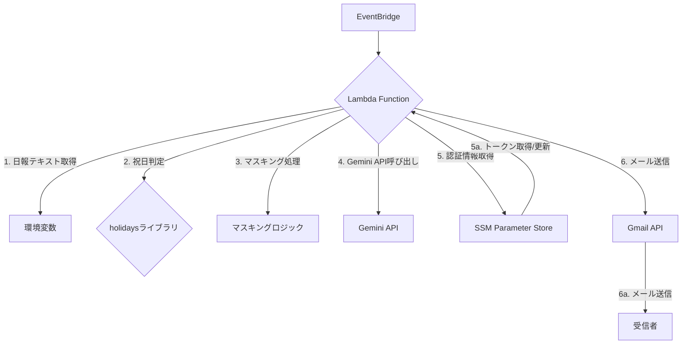
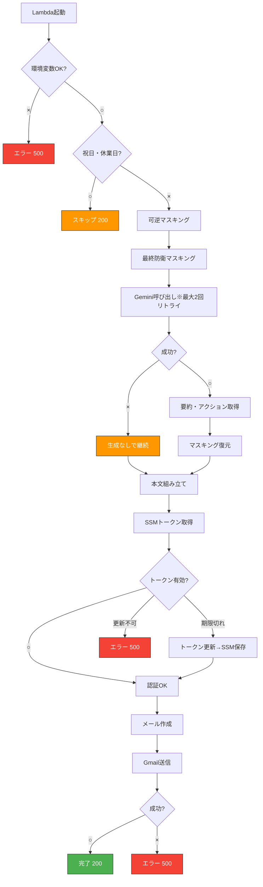

# 日報自動送信処理 基本設計書

## 1. 目的・概要

本ドキュメントは、日報を自動で送信するAWS Lambda関数の基本設計を定義するものです。

本処理は、AWS EventBridgeからのスケジュール実行をトリガーとし、環境変数で指定された日報本文をGmail経由で送信します。

また付加機能として、Google Gemini APIを利用し、日報本文から「要約」と「次のアクション案」を自動生成し、メール本文末尾に付与します。

本システムでは、**業務機密情報を外部AIサービスに直接送信しないことを重要な設計方針**とし、Gemini APIへ送信する前に複数段階のマスキング処理を実施します。

※ Geminiによる生成処理は補助的な位置づけであり、API障害・失敗時も日報送信処理自体は必ず継続されます。

---

## 2. システム構成

本処理はAWS Lambdaを主体としたサーバーレス構成で動作します。

### 2.1. 構成図



* **構成要素の役割**:

  * **EventBridge**: スケジュールに従いLambdaをトリガーします。
  * **Lambda Function**: 処理の中核であり、日報の生成・送信ロジックを実行します。
  * **環境変数**: メール送信者、宛先、件名、本文、マスキング定義などの設定情報を保持します。
  * **holidaysライブラリ**: 日本の祝日を判定し、送信をスキップするかどうかを決定します。
  * **マスキングロジック**: Gemini APIに送信する前に、業務機密情報を置換・不可逆マスキングします。
  * **Gemini API**: マスキング済みの日報本文を入力として、要約およびアクション案を生成します。
  * **SSM Parameter Store**: Gmail APIの認証情報を安全に保管・管理します。
  * **Gmail API**: 実際にメールを送信するためのGoogleのサービスです。

---

## 3. セキュリティ設計（機密情報対策）

### 3.1 設計方針

* Gemini APIへは**業務機密情報を含む生テキストを一切送信しません**。
* 機密情報対策は以下の多層防御構成とします。

1. **可逆マスキング（一次防御）**
2. **最終防衛マスキング（二次防御・不可逆）**

### 3.2 可逆マスキング（一次防御）

環境変数 `MASKING_PAIRS` に定義された置換ルールを用いて、固有名詞や識別子を一時的に置換します。

* 形式:

  ```
  置換前1=置換後1|置換前2=置換後2|...
  ```
* 定義数は数十件以上を想定します。
* 置換後の文字列には「社」「株式会社」等を含めない運用とします（最終防衛マスキングとの干渉防止）。

Gemini APIからの応答取得後、生成結果に対して**逆置換を行い、元の表現に復元**します。

### 3.3 最終防衛マスキング（二次防御・不可逆）

可逆マスキング後も残存する可能性のある会社名等を対象に、不可逆の最終マスキングを実施します。

対象とルールは以下の通りです。

* **アルファベット大文字3文字以上の単語** → `◎◎`
* **「株式会社」の前後2文字** → `◎◎株式会社` / `株式会社◎◎`
* **「社」の前後2文字** → `◎◎社` / `社◎◎`

本処理は情報秘匿を最優先とし、文章の自然さは考慮しません。
復元は行われません。

---

## 4. 処理フロー

### 4.1 フローチャート



---

## 5. データ設計

### 5.1 環境変数

| 変数名              | 説明           | 必須     |
| ---------------- | ------------ | ------ |
| SENDER_EMAIL     | 送信元メールアドレス   | 必須     |
| RECIPIENT_EMAILS | 送信先メールアドレス   | 必須     |
| CC_EMAIL         | CCメールアドレス    | 任意     |
| YOUR_NAME        | 件名に使用する氏名    | 任意     |
| EMAIL_BODY       | 日報本文         | 必須     |
| GEMINI_API_KEY   | Gemini APIキー | 必須     |
| MASKING_PAIRS    | 可逆マスキング定義    | 任意（推奨） |

---
## 付録A: Gemini生成ロジック設計（参考）

### A.1 使用モデル
- gemini-2.5-flash`

### A.2 日報要約・アクション生成ロジック概要
本システムでは、Gemini APIを「日報の解釈・判断主体」としてではなく、あらかじめ設計された枠組みに沿って文章生成を行う補助エンジンとして利用する。
生成処理は以下の3段階で構成される。

#### ① 要約生成（Gemini）

日報本文を入力として、以下の制約条件のもとで要約を生成する。
- 箇条書きで 2〜4行
- 各行は 1トピックのみ
- 1行あたり 40文字程度
- 文末は「。」で統一
- Markdown記号（*, -, • 等）は使用しない
- 前置き・補足説明・感想は一切含めない

目的：
- 日報本文を「一読で状況把握できる状態」に圧縮すること
- 後続処理（人・AI双方）で扱いやすい中間表現を作ること

#### ② 視点（テーマ）の決定（システム側）

要約内容の分析や判断は Geminiには行わせない。
代わりに、あらかじめ定義された以下のテーマ群からランダムに1つを選択し、その日の思考の軸とする。
```
リスク検知
成果最大化
チーム連携
戦略的思考
自己改善
負荷分散
属人性排除
継続性設計
意思決定の簡素化
観測と可視化
運用効率
````
設計意図：
- 内容に引きずられて同一視点に偏ることを防ぐ
- 日報を「毎回少し違う角度で読み直す」仕掛けを作る
- AIに判断を委ねず、構造は人が決めるという方針を保つ

#### ③ アクション案生成（Gemini）

日報本文と、②で決定した視点を入力として、現実的かつ簡潔なアクション案を3つ生成する。

制約条件：
- 各アクションは 1文
- 60文字以内を目安
- 背景説明・理由・総論は禁止
- 出力形式は以下に厳密に従う
```
- [アクション1]
- [アクション2]
- [アクション3]
```

目的：
- 日報を「記録」で終わらせず、次の行動に接続する
- 管理職視点での思考訓練・内省材料として使える形にする

いずれの工程でも、Geminiには機密情報を含む原文は渡されません。
