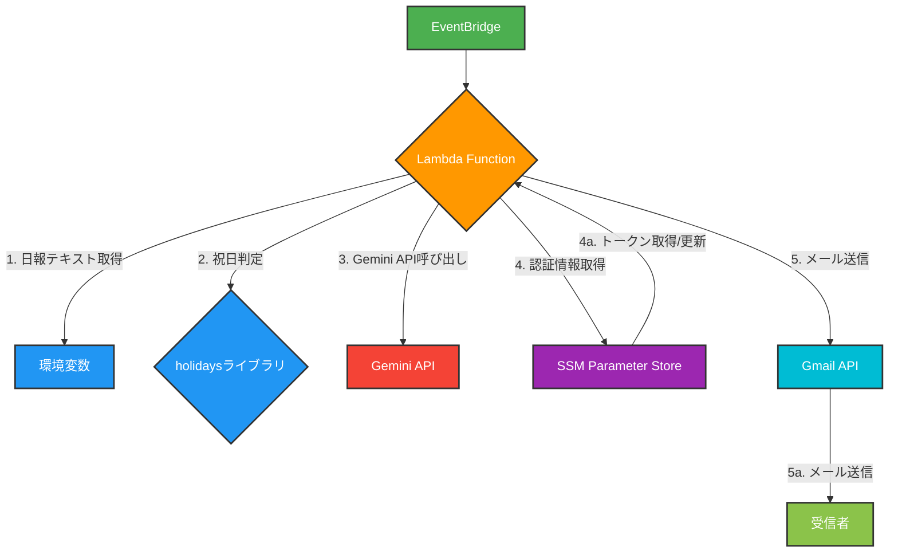

# 日報自動送信処理 基本設計書

## 1. 目的・概要

本ドキュメントは、日報を自動で生成・送信するAWS Lambda関数の基本設計を定義するものです。本処理は、AWS EventBridgeからのイベントをトリガーとし、指定された日報テキストをGmail経由で送信します。また、Google Gemini APIを活用して日報の要約と次へのアクション案を自動生成し、メール本文に付加することで、日報作成の効率化と内容の充実を図ります。

主な機能は以下の通りです。

- **日報メールの自動生成と送信**
- **祝日判定による送信スキップ**

## 2. システム構成

本処理はAWS Lambdaを主体としたサーバーレス構成で動作します。

### 2.1. 構成図

- **構成要素の役割**:
  - **EventBridge**: スケジュールに従いLambdaをトリガーします。
  - **Lambda Function**: 処理の中核であり、日報の生成・送信ロジックを実行します。
  - **環境変数**: メール送信者、宛先、件名、本文などの設定情報を保持します。
  - **holidaysライブラリ**: 日本の祝日を判定し、送信をスキップするかどうかを決定します。
  - **Gemini API**: 日報の要約とアクション案を自動生成します。
  - **SSM Parameter Store**: Gmail APIの認証情報を安全に保管・管理します。
  - **Gmail API**: 実際にメールを送信するためのGoogleのサービスです。
  - **受信者**: 送信された日報メールを受け取る人です。

## 3. 処理フロー

本処理の実行フローを以下に示します。

- **起動**: AWS EventBridgeからのスケジュールイベントにより、Lambda関数が起動されます。
- **環境変数取得**: 必須の環境変数が設定されているか確認し、メール送信に必要な情報を取得します。
- **祝日判定**: 実行日が日本の祝日である場合、メールを送信せずに処理を終了します。
- **Gemini API呼び出し**: 日報テキストをGemini APIに送り、要約とアクション案を生成します。API呼び出しが失敗した場合でも、処理は継続します。
- **認証情報取得**: AWS Systems Manager Parameter StoreからGmail API認証用のトークンを取得します。トークンが期限切れの場合は自動で更新し、Parameter Storeに保存します。
- **メール作成**: 日報テキストとGeminiが生成した内容を組み合わせて、メールの件名と本文を作成します。
- **メール送信**: Gmail APIを使用してメールを送信します。
- **終了**: メール送信が完了したら、処理は正常終了します。

## 4. データ設計
### 4.1. 環境変数
| 変数名 | 説明 | 形式 |
|---|---|---|
| SENDER_EMAIL | 送信元メールアドレス | 文字列 |
| RECIPIENT_EMAILS | 送信先メールアドレス | 文字列（カンマ区切り可） |
| CC_EMAIL | CCメールアドレス | 文字列（カンマ区切り可） |
| YOUR_NAME | 日報の差出人名（件名に使用） | 文字列 |
| EMAIL_BODY | 日報の本文 | 文字列 |
| GEMINI_API_KEY | Gemini APIの認証キー | 文字列 |

### 4.2. AWS Systems Manager Parameter Store
| パラメータ名 | 説明 | 形式 |
|---|---|---|
| /gmail/token | Gmail APIのOAuth 2.0トークン | JSON文字列（SecureString） |

## 5. エラーハンドリング
| エラーケース | 原因 | 対応策 |
|---|---|---|
| 環境変数未設定 | 必須の環境変数が設定されていない | エラーログを出力し、終了する。 |
| Parameter Storeエラー | トークンが見つからない、または取得できない | エラーログを出力し、終了する。 |
| Gemini API呼び出しエラー | APIキーが無効、リクエスト形式が不正など | エラーログを出力するが、処理は継続する。 |
| Gmail API認証エラー | トークンの期限切れ、スコープの不一致など | エラーログを出力し、終了する。 |
| メール送信エラー | ネットワークエラー、宛先アドレスが無効など | エラーログを出力し、終了する。 |
