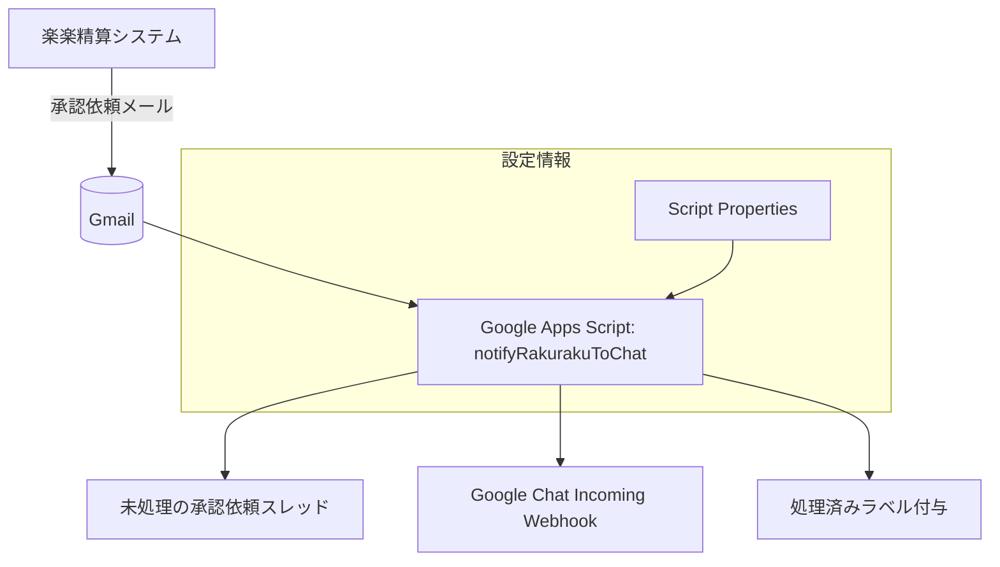
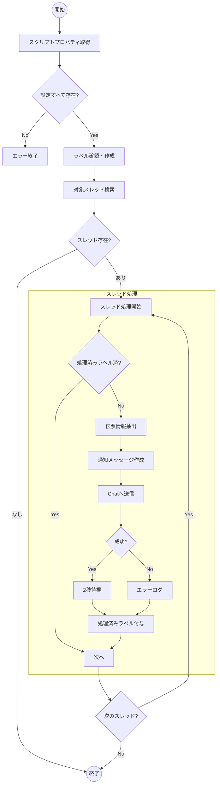

# 基本設計書  
楽楽精算承認依頼メール → Google Chat 通知スクリプト

## 1. 概要

楽楽精算システムから送信される「承認依頼」メールを定期的に監視し、  
未処理のもの（特定のラベルが付いていないもの）のみを抽出し、  
重要な情報を整形してGoogle Chat（Webhook経由）に通知するGoogle Apps Script。

## 2. システム構成図



## 3. データフロー



## 4. スクリプトプロパティ定義

| キー名          | 説明                                      | 必須 | 例値例                                      |
|-----------------|-------------------------------------------|------|---------------------------------------------|
| WEBHOOK_URL     | Google Chat Incoming Webhook URL          | 必須 | https://chat.googleapis.com/v1/spaces/...   |
| RAKURAKU_FROM   | 楽楽精算の送信元メールアドレス            | 必須 | info@rakuraku-seisan.jp                     |
| LABEL_NAME      | 処理済み判定用Gmailラベル名               | 必須 | 楽楽精算_処理済                             |

**設定方法**  
Google Apps Script エディタ → 左メニュー「プロジェクトの設定」→「スクリプト プロパティ」  
またはスクリプト内で一度だけ以下を実行：

```javascript
PropertiesService.getScriptProperties().setProperties({
  WEBHOOK_URL: "https://chat.googleapis.com/v1/...",
  RAKURAKU_FROM: "info@rakuraku-seisan.jp",
  LABEL_NAME: "楽楽精算_処理済"
});
```

## 5. 主な検索条件

```
from:{RAKURAKU_FROM} "承認依頼" -label:{LABEL_NAME} older_than:2m
```

- `older_than:2m` → 2ヶ月以上前のものは除外（負荷軽減目的。状況に応じて1mや3mなどに変更可）

## 6. 留意点・今後の改善候補

- スレッド内複数メッセージの扱い（現在は全部見るが最新のみでよい可能性も）
- 1通に複数伝票が含まれる場合の対応強化
- エラー発生時の管理者通知（メール送信など）
- 通知フォーマットの改善（表形式、リンク埋め込みなど）
